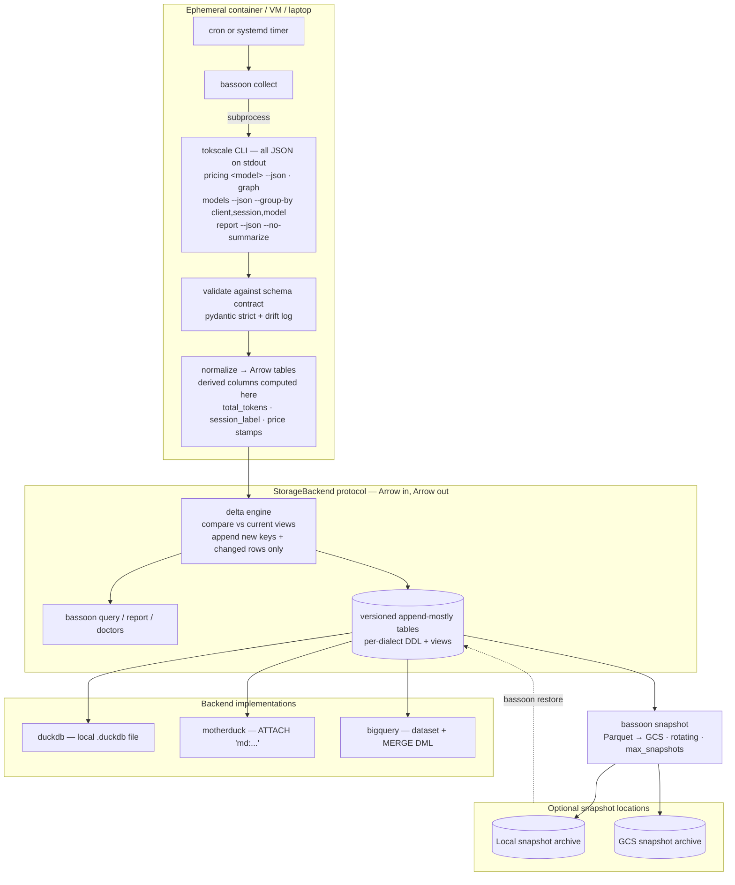

<!--
SPDX-FileCopyrightText: 2026 Israel Flores-Arbolay
SPDX-License-Identifier: AGPL-3.0-only
-->

# UsageBassoon — Agent Context

## Purpose

A Python CLI and library (pipx-installable, import usagebassoon) that persists `tokscale` JSON token usage statistics to a persistent data store into DuckDB or MotherDuck. This allows users to aggregate token usage across agentic environments.

## Repository Structure
```
usagebassoon/
├── pyproject.toml            # hatchling; pipx-installable; Python >= 3.11
├── src/usagebassoon/
│   ├── cli/                  # typer app; one module per CLI command
│   ├── parsers/              # one module per payload kind
│   │   ├── models.py         # per session×model rows → session_model_stats
│   │   ├── report.py         # session metadata       → sessions (no LLM summary fields)
│   │   ├── graph.py          # daily contributions    → daily_stats/daily_activity/run_metrics
│   │   └── pricing.py        # rates + resolution     → pricing_snapshots + row stamps
│   ├── contracts/            # JSON schema contracts per payload kind
│   ├── backends/
│   │   ├── base.py           # StorageBackend protocol
│   │   ├── duckdb_local.py
│   │   ├── motherduck.py
│   │   └── bigquery.py
│   ├── collector.py          # tokscale subprocess + retry
│   ├── arrow_port.py         # normalizer: models → Arrow, derived columns
│   ├── drift.py              # schema_drift detection + reporting
│   ├── snapshots.py          # local/GCS rotating snapshots + restore
│   ├── merge.py              # staging + delta append + current-view logic + rebuild + session_label
│   ├── reconcile.py          # cross-payload consistency checks
│   ├── curation.py           # tags + notes
│   ├── obfuscate.py          # export-time pseudonymization
│   ├── report_term.py        # rich tables + plotext charts
│   ├── api.py                # usagebassoon.query/connect (pandas default, polars opt-in)
│   ├── sql/                  # ddl + views, loaded as package data
│   │   ├── duckdb/{ddl.sql, views.sql}    # also serves motherduck
│   │   └── bigquery/{ddl.sql, views.sql}
├── tests/
│   ├── fixtures/             # sanitized golden captures: models, report, graph, pricing
│   └── test_*.py             # incl. fixture-derived invariants
└── .github/workflows/        # ci (ruff, pyrefly, pytest), dialect-parity, release to PyPI
```

## Architecture

- **Dependencies**: `duckdb`, `pandas`, `pydantic`, `pyarrow`, `typer`, `rich`, `plotext`, `polars` (optional).
- **Dev Environment**: `uv`, `hatchling`, `twine`, `pyrefly`, `ruff`, `pytest`, `just`, `pre-commit`.



## Commands

Run all project tasks via `just` from the repository root. Use `just --list` to inspect available recipes.

- USE `just install-dev` to synchronize all uv dependency groups.
- USE `just test` to run the test suite; pass pytest arguments with `just test <args>`.
- USE `just coverage` to run test suite with terminal coverage reporting.
- USE `just lint` to perform Ruff linting and formatting checks.
- USE `just typecheck` to perform Pyrefly type checks.
- USE `just spell-diff` to run typos spelling checker.
- PREFER `just ci` for combined test, lint, and typecheck recipes.
- USE `just build` to clean `dist/` and build an sdist and wheel with Hatchling.
- USE `just check-dist` to clean, build, and validate artifacts with Twine.
- USE `just clean` to remove build artifacts and local caches.

## Rules

- ALL Python code should target Python 3.12+ syntax only.
- ALL generated/edited Python source code MUST pass Ruff and Pyrefly checks through `just lint` and `just typecheck`, respecitively. You MUST run Ruff and Pyrefly as a matter of routine after generating or editing any Python source code.
- Do NOT suppress diagnostics to make checks pass. Do NOT introduce implicit `Any` or use bare generic types.
- PREFER PEP 695 syntax for **all** new generic declarations and type aliases. USE modern built-in generic and union syntax.
- USE Google-style docstrings for **all** source code.
- KEEP comments concise yet clear. Do NOT use numbered headers (e.g. "1." or "(1)" etc).
- NO version string is ever hard-coded in source; `hatch-vcs` manages version numbering from git tags (`v0.1.0` → `0.1.0`).

### Prohibitions
The following actions are **prohibited** and are reserved exclusively for the user. When encountering a task that involves a prohibited action, you MUST **stop** and **report** to the user the conflict:

- NEVER modify the golden JSON fixtures in `tests/fixtures/`.
- NEVER attempt to publish to PyPI or invoke any publishing command; consequently, NEVER use `just publish` or `just release`.
- NEVER attempt to perform a release to GitHub or invoke any release command.
- NEVER attempt to push git changes to GitHub.

## Design Brief

The main **goal** of this project is to *never* lose token-usage history. Users should be able to work from any emphemeral environment (e.g containers, rotating VMs) and be able to persist the token suage statistics from their agents with a single credential (e.g. `MOTHERDUCK_TOKEN`) and zero local secrets. Consequent design goals include:

- Persist the following statistics:
  - costs
  - input/output/cache-read/cache-write/reasoning tokens
  - data granularity: per-session, per-model, per-day
  - point-in-time pricing
  - session timestamps
  - project attribution
  - system details: OS, CPU, RAM, shell environment
- Idempotent design, merge-based ingestion — safe to run on a cron from N machines
- Query anything with SQL; export to `pandas` DataFrame in two lines; `polars` optionally supported
- User-curated organization: per-session and per-client tags, free-text notes
- Terminal-first text-based reporting via `rich` and rendering of charts via `plotext`
- Pluggable storage: MotherDuck (hosted) or a local DuckDB file (zero deps)

The following are out-of-scope and/or antithetical to the design goals:

- TUI, web server, or HTML report generator
- Parsing of agent session files — in v1 we will use `tokscale` to extract token data
- Persistence of tokscale's generated summary fields which have non-deterministic provenance, including:
  - `title`,
  - `task_category`
  - `description`
  - `task_group`

### Important Design Decisions

- **tokscale derived metrics:** We invoke `tokscale` as a subprocess and treat its stdout as the only source of truth for token usage statistics. A future major version may make token statistics collection native.

- **tokscale-resolved pricing only:** Rejected deriving price data from external APIs like Models.dev or LiteLLM because (a) usagebassoon wraps tokscale, and storing rates tokscale did *not* use breaks data fidelity between `cost_usd` and the embedded prices; (b) it would silently ignore downstream users' `custom-pricing.json` tokscale overrides; (c) corrective pricing under any rate card is a query-time recomputation users can do themselves.

- **No at-rest obfuscation of stored data:** Session data is stored raw at-rest and obfuscated at export-time. The CLI command `bassoon export` will *default* to obfuscating potentially personal information including session IDs, workspace names and paths, project names, and anything similar. For example, a project name may be pseudonymized as "project-alpha". Downstream users may optionally export their raw data as JSON via the flag `--raw-json`.

- **Library + CLI:** Everything the CLI does is importable Python.

- **Raw tokscale data storage:** Raw tokscale JSON output will be persisted and updated by addition only. tokscale only outputs full JSON token usage history. The initial output for a given user environment will be persisted uniquely while subsequent JSON outputs will be updated based only on their additions. Data absent from tokscale's subsequent output (e.g. due to a deleted agent session) will *remain* in the usagebassoon database. Only data additions will be ingested.

- **Append-mostly delta semantics of raw tokscale data:** Raw tokscale JSON output from every `bassoon collect` compares tokscale's cumulative state against the raw data warehouse's current state and appends only what changed. Curated fact tables carry a `collected_at` version column. A collect run stages the incoming Arrow batch, anti-joins it against the *current* state (a view selecting the latest row per natural key), and appends only:
  - **Additions** — natural keys not present in the warehouse, and
  - **In-line updates** — natural keys present, but one or more measured fields changed (higher cost, more tokens, longer duration, etc.).

  A re-sent identical snapshot appends nothing. History is therefore preserved per key; dashboards use the `current_*` views, while `history` is queryable directly. **Absence is never propagated**. If tokscale stops reporting a session (e.g. pruning, compaction, user deletion of the agent session file), the warehouse retains the last observed state. **Exemption**: Users may delete or overwrite their own tags/notes; the append-mostly rule applies to tokscale-derived data only.

- **Data ingest pipeline:** `bassoon collect` (target runtime < 10s):
  1. Resolve tokscale (`TOKSCALE_BIN`, else `tokscale` on PATH, else `bunx tokscale@latest`). Record version from graph payload meta.
  2. Run the extraction set: `pricing` per distinct model first (both calls then observe the same LiteLLM ~1h disk-cache state), then `models`, `graph`, `report --no-summarize`. All emit JSON on stdout.
  3. Validate against the schema contract with pydantic strict mode. Required-field absence **fails the run** with a clear error; *unknown* fields or changed cardinalities are **drift events** — recorded in `schema_drift`, surfaced in output, surfaced again on the next `bassoon doctor`, and the run continues (tolerant reader) so collection is never blocked by additive changes. (Be careful! this can cause migration issues if a hotfix is released!)
  4. Reconcile models ↔ report session overlap and cost drift; graph totals ↔ models grand totals per token type. Mismatches go to `ingest_runs` and are surfaced by `bassoon doctor`.
  5. Normalize to Arrow tables; compute derived columns. Stage each fact table in one batch.
  6. **Delta merge**: anti-join staged rows against the `current_*` view on natural key + measured-field tuple; append additions and superseding updates in one transaction (BigQuery: `MERGE` DML; DuckDB/MotherDuck: transactional delete-free `INSERT`). Tags/notes untouched.
  7. Optionally: if `snapshots.interval` has elapsed, run `bassoon snapshot`.
  - Concurrent collectors are safe: delta appends are keyed by `(natural_key, collected_at)` (uuid/stamped), merges are per-key idempotent, and last-writer-wins is correct for cumulative snapshots at the view level.

- **Database management:** Locally, data will be managed and stored by DuckDB. Remotely, data will be managed and stored by either MotherDuck or GCP BigQuery. DDL and SQL views will be written natively to their respective dialect (e.g. `sql/duckdb/{ddl,views}.sql` and `sql/bigquery/{ddl,views}.sql`). `SQLGlot` will be used during CI to prevent structural drift. Dedicated pytests will be used during CI to prevent semantic drift against the golden fixtures.

- **Database CI: `.github/workflows/dialect-parity.yml`** — on every PR that touches `sql/` or `tests/fixtures/`:
  1. `SQLGlot` parses both dialects' DDL/views.
  2. Transpiles `bigquery/*` → duckdb dialect, asserts AST-equivalence against the duckdb tree (and vice-versa for the view sets).
  3. A **replay test** runs the same golden-fixture dataset through both dialects in DuckDB (translated BigQuery SQL) and asserts identical result sets. Transpiler parity is *structural*, not semantic.

- **Ingest semantics:** tokscale reports *cumulative* totals per session in `models`; dedupe keeps the latest snapshot per key and values are never summed across rows. `graph` contributions are per-day facts (additive by nature) and merge by their natural key `(day, client, model)`. Tags and notes are owned by the user and are never touched by merge — they persist across `collect` runs and are exported by `bassoon export` like any other table.

- **Snapshot semantics:** Optional layer providing portability, restore, and seed:
  - `bassoon snapshot` writes every table to Parquet locally at `~/.usagebassoon/snapshots/` or remotely in GCS `gs://<uri>/<UTC-date>-<short-sha>/`, plus a `manifest.json` (table list, row counts, tokscale contract version, DuckDB/BigQuery schema hashes).
  - Rotation: after each snapshot, delete the oldest if more than `max_snapshots` exist.
  - `bassoon restore --from-snapshot [latest|date|run]` hydrates a fresh environment (new container, new VM, local↔cloud migration) — reads Parquet → Arrow → backend append path unchanged.
  - Snapshots are the substrate for `bassoon export` portability too; the export path is the same code with `--sanitize` applied.

- **Schema contracts:** Each tokscale payload kind has a versioned contract — the expected field names, types, and cardinalities, pinned against a tokscale version. The contract lives in `src/usagebassoon/contracts/{models,graph,pricing,report}.json`, generated from golden fixtures and asserted in tests. Deviation produces `schema_drift` rows and a user-facing warning and asks for a bug report:

```
$ bassoon collect
⚠ schema drift detected (tokscale 4.15.2 vs contract 4.15.1):
    models: unknown field 'entries[].performance.gpu_util'
    pricing: field 'resolution.priceConsensus' changed type (number → object)
  → collection <status>.
    Run `bassoon doctor` for detail. Open an issue: https://github.com/israelflores8789/usagebassoon/issues/new
```

- **Data-engine agnostic abstraction:** `DatabaseBackend` in `backends/base.py` is deprecated and will be replaced with `StorageBackend`, a higher-order abstraction using Arrow. Implementations:
  - `duckdb_local.py` — local file; `register(arrow_table)` is zero-copy
  - `motherduck.py` — identical code path, `md:` connection string
  - `bigquery.py` — `google-cloud-bigquery`; `merge()` via `MERGE` DML on a staging table; Arrow → load job → stage; query → `.to_arrow()`

  Derived columns (`total_tokens`, `session_label`, per-row pricing stamps) are computed **in the normalizer**, before the protocol layer — so dialect differences in computed-column DDL never leak into data. The pipeline is:
  ```
  tokscale JSON → pydantic contract validation (strict, drift events)
              → pydantic models (typed objects)
              → Arrow normalizer (batch, derived columns, canonical schema)
              → StorageBackend (dialect-specific executor)
              → pandas/polars/Arrow on the way back via `to_arrow()`
  ```

### Canonical Ingest Commands

These are the `tokscale` commands used to generate ingest data. Each command is authoritative for their given data domain. Cross-payload reconciliation runs at ingest. Mismatches are surfaced to request bug reporting, never silently resolved:

- `tokscale models --json --group-by client,session,model --merge-worktrees` — authoritative for token/cost metrics.
- `tokscale report --json --no-summarize` — authoritative for session metadata.
- `tokscale graph` — authoritative for daily statistics granularity.
- `tokscale pricing <model-id> --json` — authoritative for current point-in-time rates.

### Shipped views (per-dialect: `sql/{duckdb,bigquery}/views.sql`)

- `daily_cost` — cost and tokens per day
- `cost_by_model` — lifetime cost/tokens per model and client
- `cost_by_workspace` — cost and duration per project
- `cache_efficiency` — cache_read hit ratios per model
- `burn_rate` — trailing 7/30-day daily averages
- `session_leaderboard` — top sessions by cost
- `session_deltas` — derived from version history directly
  (`lag()` over `collected_at`), no longer depending on detection
- `price_drift` — rate changes per model over time
- `throughput` — ms_per_1k_tokens distributions per model
- `tagged_sessions`, `cost_by_tag`, `tokens_by_tag` — curation views

### Proposed CLI

| Command | Purpose |
|---|---|
| `bassoon init` | create config + per-backend DDL + views |
| `bassoon collect` | one delta-ingest cycle (designed for cron) |
| `bassoon query "<sql>"` | ad-hoc SQL → rich table; `--format csv\|json\|parquet`; `--sanitize` |
| `bassoon report` | terminal summary; `--sanitize` |
| `bassoon report --save out.txt` | render incl. charts to text |
| `bassoon tag` / `note` | user curation |
| `bassoon rebuild` | full replay: restore latest snapshot + re-ingest since (was raw_exports replay in v1 — raw_exports no longer exists) |
| `bassoon snapshot` / `bassoon restore` | write/read rotating GCS Parquet snapshots |
| `bassoon export` | dump any table/view to parquet/csv; `--sanitize` |
| `bassoon runs` | ingest audit log incl. run_metrics |
| `bassoon doctor` | credentials, connectivity, reconciliation, unresolved schema_drift, with issue link |

### Proposed Python API

`pandas` is the *default*; `polars` is first-class:

```python
import usagebassoon

df  = usagebassoon.query("SELECT * FROM cost_by_model")                   # pandas
df  = usagebassoon.query("SELECT * FROM daily_cost", engine="polars")     # polars
tbl = usagebassoon.query_arrow("SELECT * FROM current_sessions")          # raw Arrow
con = usagebassoon.connect()          # duckdb conn, or ibis-style BigQuery session
```

### Proposed Configuration Schema

`~/.config/usagebassoon/config.toml` (user-global):

```toml
backend = "duckdb"            # duckdb | motherduck | bigquery
database = "usagebassoon"     # duckdb: file path · motherduck: db name · bigquery: dataset

[tokscale]
bin = "bunx tokscale@latest"

[bigquery]                    # only when backend = "bigquery"
project = "my-project"
location = "us-central1"
# credentials: GOOGLE_APPLICATION_CREDENTIALS, or `gcloud auth application-default login`

[snapshots]                   # optional; absent = feature off
gcs_uri = "gs://my-bucket/usagebassoon/snapshots"
max_snapshots = 10            # rotating retention
interval = "12h"              # taken during collect when elapsed
```
