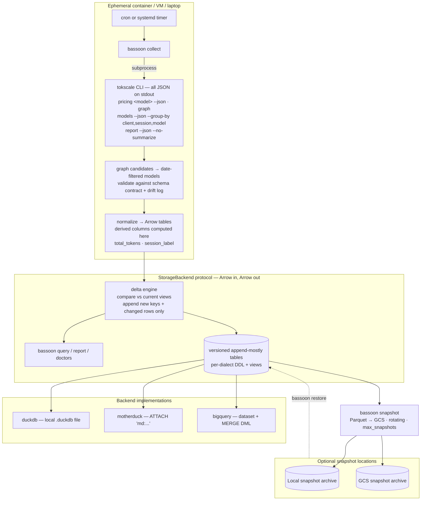

<!--
SPDX-FileCopyrightText: 2026 Israel Flores-Arbolay
SPDX-License-Identifier: AGPL-3.0-only
-->

# UsageBassoon — Agent Context

## Purpose

A Python CLI and library (pipx-installable, import usagebassoon) that persists `tokscale` JSON token usage statistics to DuckDB, MotherDuck, or BigQuery. This allows users to aggregate token usage across agentic environments.

## Repository Structure
```
usagebassoon/
├── pyproject.toml            # hatchling; pipx-installable; Python >= 3.12
├── src/usagebassoon/
│   ├── __init__.py
│   ├── cli/                  # Typer app; one module per CLI command
│   ├── parsers/              # one module per payload kind
│   │   ├── __init__.py
│   │   ├── daily.py          # date-filtered models rows → daily_stats
│   │   ├── models.py         # grouped tokscale models payload parser
│   │   ├── report.py         # session metadata       → sessions (no LLM summary fields)
│   │   ├── graph.py          # activity and candidate dates → daily_activity
│   │   └── pricing.py        # rates + resolution     → price_versions
│   ├── contracts/            # JSON schema contracts per payload kind
│   │   ├── models.json
│   │   ├── report.json
│   │   ├── graph.json
│   │   └── pricing.json
│   ├── contracts.py          # contract loading, validation, and drift detection
│   ├── backends/
│   │   ├── __init__.py
│   │   ├── base.py           # StorageBackend protocol
│   │   ├── duckdb_local.py
│   │   ├── motherduck.py
│   │   ├── bigquery.py
│   │   └── gcs.py            # generation-safe GCS archive adapter
│   ├── reports/              # terminal rich tables + plotext charts; one module per report type
│   ├── collector.py          # tokscale subprocess + retry
│   ├── frames.py             # Arrow conversion to pandas or optional polars
│   ├── ingest.py             # raw payload contract validation and parsing
│   ├── json_types.py         # recursive types for JSON-decoded payloads
│   ├── normalizer.py         # daily facts and price versions → Arrow
│   ├── drift.py              # schema_drift detection + reporting
│   ├── snapshots.py          # catalog-published local/GCS snapshots + restore
│   ├── merge.py              # staging + daily current-state upserts
│   ├── reconcile.py          # report/session consistency checks
│   ├── curation.py           # tags + notes
│   ├── system_metadata.py    # best-effort collector-host metadata
│   ├── obfuscate.py          # export-time pseudonymization
│   ├── api.py                # usagebassoon.query/connect (pandas default, polars opt-in)
│   ├── sql/                  # ddl + views, loaded as package data
│   │   ├── duckdb/{ddl.sql, views.sql}    # also serves motherduck
│   │   └── bigquery/{ddl.sql, views.sql}
├── tests/
│   ├── __init__.py
│   ├── conftest.py           # shared golden-payload fixtures and collection bundle
│   ├── fixtures/             # sanitized golden captures: daily, models, report, graph, pricing
│   │   ├── golden-2026-09-10-tokscale-4.15.1.graph.json
│   │   ├── golden-2026-09-10-tokscale-4.15.1.models.json
│   │   ├── golden-2026-09-10-tokscale-4.15.1.pricing.json
│   │   └── golden-2026-09-10-tokscale-4.15.1.report.json
│   ├── test_backends.py      # StorageBackend integration and DDL checks
│   ├── test_cli_curation.py  # tag/note command integration
│   ├── test_cli_init.py      # config and schema initialization
│   ├── test_cli_restore.py   # snapshot restore command integration
│   ├── test_cli_snapshot.py  # snapshot command integration
│   ├── test_collector_daily.py # daily candidate selection and retries
│   ├── test_contracts.py     # schema-contract and drift validation
│   ├── test_merge.py         # delta persistence semantics
│   ├── test_parsers.py       # fixture-derived parser invariants
│   ├── test_reconcile.py     # cross-payload consistency checks
│   └── test_snapshots.py     # catalog, retention, cadence, and GCS behavior
└── .github/workflows/        # ci (ruff, pyrefly, pytest), dialect-parity, release to PyPI
```

Golden fixture filenames use `golden-<capture-date>-tokscale-<exact-version>.<payload-kind>.json`, for example `golden-2026-09-10-tokscale-4.15.1.models.json`. The tokscale version is the exact referenced version, never `latest`; prerelease versions remain unchanged, such as `tokscale-4.16.0-rc.1`.

## Architecture

- **Dependencies**: `duckdb`, `pandas`, `pydantic`, `pyarrow`, `typer`, `rich`, `plotext`, `polars` (optional).
- **Dev Environment**: `uv`, `hatchling`, `twine`, `pyrefly`, `ruff`, `pytest`, `just`, `pre-commit`.



## Commands

Run all project tasks via `just` from the repository root. Use `just --list` to inspect available recipes.

- USE `just install-dev` to synchronize all uv dependency groups.
- USE `just test` to run the test suite; pass pytest arguments with `just test <args>`.
- USE `just coverage` to run test suite with terminal coverage reporting.
- USE `just lint` to perform Ruff linting and formatting checks.
- USE `just typecheck` to perform Pyrefly type checks.
- USE `just spell-diff` to run typos spelling checker.
- PREFER `just ci` for combined test, lint, and typecheck recipes.
- USE `just build` to clean `dist/` and build an sdist and wheel with Hatchling.
- USE `just check-dist` to clean, build, and validate artifacts with Twine.
- USE `just clean` to remove build artifacts and local caches.

## Rules

- ALL Python code should target Python 3.12+ syntax only.
- ALL generated/edited Python source code MUST pass Ruff and Pyrefly checks through `just lint` and `just typecheck`, respecitively. You MUST run Ruff and Pyrefly as a matter of routine after generating or editing any Python source code.
- Do NOT suppress diagnostics to make checks pass. Do NOT introduce implicit `Any` or use bare generic types.
- PREFER PEP 695 syntax for **all** new generic declarations and type aliases. USE modern built-in generic and union syntax.
- USE Google-style docstrings for **all** source code.
- KEEP comments concise yet clear. Do NOT use numbered headers (e.g. "1." or "(1)" etc).
- FOR module-level docstrings, ADD the name of the module to the start of the docstring (e.g. """my_module.py — ...).
- NO version string is ever hard-coded in source; `hatch-vcs` manages version numbering from git tags (`v0.1.0` → `0.1.0`).
- Do NOT wrap lines when generating markdown text.
- ALWAYS use the `usagebassoon_it` dataset when live testing with BigQuery. NEVER perform tests on any other dataset. **NEVER** perform tests on a dataset called only `usagebassoon`.
- ALWAYS use the `gs://usagebassoon-test-snapshots-gen-lang-client-0670612427` Google Cloud Storage bucket for GCS testing. NEVER perform tests on any other GCS bucket.

### Prohibitions
The following actions are **prohibited** and are reserved exclusively for the user. When encountering a task that involves a prohibited action, you MUST **stop** and **report** to the user the conflict:

- NEVER modify the golden JSON fixtures in `tests/fixtures/`.
- NEVER attempt to publish to PyPI or invoke any publishing command; consequently, NEVER use `just publish` or `just release`.
- NEVER attempt to perform a release to GitHub or invoke any release command.
- NEVER attempt to push git changes to GitHub.

## Design Brief

The main **goal** of this project is to *never* lose token-usage history. Users should be able to work from any emphemeral environment (e.g containers, rotating VMs) and be able to persist the token suage statistics from their agents with a single credential (e.g. `MOTHERDUCK_TOKEN`) and zero local secrets. Consequent design goals include:

- Persist the following statistics:
  - costs
  - input/output/cache-read/cache-write/reasoning tokens
  - data granularity: per-session, per-model, per-day
  - point-in-time pricing
  - session timestamps
  - project attribution
  - system details: OS, CPU, RAM, shell environment
- Idempotent design, merge-based ingestion — safe to run on a cron from N machines
- Query anything with SQL; export to `pandas` DataFrame in two lines; `polars` optionally supported
- User-curated organization: source-scoped workspace/client/session tags and session notes
- Terminal-first text-based reporting via `rich` and rendering of charts via `plotext`
- Pluggable storage: MotherDuck (hosted) or a local DuckDB file (zero deps)

The following are out-of-scope and/or antithetical to the design goals:

- TUI, web server, or HTML report generator
- Parsing of agent session files — in v1 we will use `tokscale` to extract token data
- Persistence of tokscale's generated summary fields which have non-deterministic provenance, including:
  - `title`,
  - `task_category`
  - `description`
  - `task_group`

### Important Design Decisions

- **tokscale derived metrics:** We invoke `tokscale` as a subprocess and treat its stdout as the only source of truth for token usage statistics. A future major version may make token statistics collection native.

- **Daily tokscale pricing:** `price_versions` stores the tokscale rates observed for each model with activity on a processed day. `daily_cost` calculates `cost_usd` from those rates and daily token components; `tokscale_cost_usd` remains diagnostic. Historical price drift before collection is the downstream user's responsibility.

- **No at-rest obfuscation of stored data:** Session data is stored raw at-rest and obfuscated at export-time. The CLI command `bassoon export` will *default* to obfuscating potentially personal information including session IDs, workspace names and paths, project names, and anything similar. For example, a project name may be pseudonymized as "project-alpha". Downstream users may optionally export their raw data as JSON via the flag `--raw-json`.

- **Library + CLI:** Everything the CLI does is importable Python.

- **Source identity:** `source_id` is a UUID in configuration, generated by `usagebassoon init`. It namespaces every collected fact and curation target. Reuse it only for environments intentionally representing one source.

- **Session and curation identity:** A session key is `(source_id, client, session_id)`; workspace remains metadata. Client and workspace are peer scopes, not a hierarchy. Effective session tags combine direct session tags with tags on its source-scoped client and workspace.

- **Daily facts:** `tokscale graph` supplies candidate dates and `daily_activity`. For each candidate day, date-filtered `tokscale models` supplies `daily_stats` at `(source_id, day, client, session_id, model)`. Completed historical targets skip by default; the current day refreshes.

- **Token calculation invariants:**
  - "reasoning" tokens are a component of the total token count such that total_tokens = input + cache_read + cache_write + reasoning + output tokens (fixture-verified against tokscale 4.15.1).
  - "reasoning" tokens are considered output tokens for pricing purposes (fixture-verified against tokscale 4.15.1).

- **Data ingest pipeline:** `bassoon collect`:
  1. Resolve tokscale (`TOKSCALE_BIN`, else `tokscale` on PATH, else `bunx tokscale@latest`). Record version from graph payload meta.
  2. Run `graph`, use its contribution dates to select daily models work, run date-filtered `models` per required day, then fetch prices for each model used on those days and `report --no-summarize`.
  3. Validate against the schema contract with pydantic strict mode. Required-field absence **fails the run** with a clear error; *unknown* fields or changed cardinalities are **drift events** — recorded in `schema_drift`, surfaced in output, surfaced again on the next `bassoon doctor`, and the run continues (tolerant reader) so collection is never blocked by additive changes. (Be careful! this can cause migration issues if a hotfix is released!)
  4. Graph totals are not reconciled with daily models totals; graph is only the activity and candidate-date source.
  5. Normalize to Arrow tables; compute derived columns. Stage each fact table in one batch.
  6. Stage the Arrow batch, match rows by natural key, update changed existing rows, insert new rows, and leave absent rows untouched. Use one transactional upsert/MERGE per collection run; **never** delete.
  7. Optionally: if `snapshots.interval` has elapsed, run `bassoon snapshot`.

- **Database management:** Locally, data will be managed and stored by DuckDB. Remotely, data will be managed and stored by either MotherDuck or GCP BigQuery. DDL and SQL views will be written natively to their respective dialect (e.g. `sql/duckdb/{ddl,views}.sql` and `sql/bigquery/{ddl,views}.sql`). `SQLGlot` will be used during CI to prevent structural drift. Dedicated pytests will be used during CI to prevent semantic drift against the golden fixtures.

- **Database CI: `.github/workflows/dialect-parity.yml`** — on every PR that touches `sql/` or `tests/fixtures/`:
  1. `SQLGlot` parses both dialects' DDL/views.
  2. Transpiles `bigquery/*` → duckdb dialect, asserts AST-equivalence against the duckdb tree (and vice-versa for the view sets).
  3. A **replay test** runs the same golden-fixture dataset through both dialects in DuckDB (translated BigQuery SQL) and asserts identical result sets. Transpiler parity is *structural*, not semantic.

- **Ingest semantics:** Date-filtered `models` rows are upserted at daily session/model grain. `graph` contributions are authoritative only for `daily_activity` and candidate dates. `session_model_stats` is an all-time calculated view over `daily_stats`. Tags and notes are owned by the user and are never touched by merge.

- **Snapshot semantics:** Snapshots are portable normalized-table archives, not raw-payload replay points. Every backend—including BigQuery—reads canonical Arrow tables and writes deterministic Parquet through UsageBassoon; never use a server-side BigQuery-to-GCS export.
  - A snapshot is restorable only after every expected table succeeds, its complete manifest is written, and the manifest is published in the archive catalog. Uncataloged prefixes are staging/orphans, never restore candidates.
  - The catalog defines `latest`, cadence, and FIFO retention. GCS catalog publication uses generation compare-and-swap plus a short fenced reservation; cleanup is generation-conditional and must never delete the latest published snapshot. Local archives use the same catalog semantics.
  - Restore validates catalog membership, complete table coverage, and destination schema compatibility before appending any data. The destination must be initialized and empty; a failed restore can leave partial data and must be retried from a fresh/emptied destination.
  - `interval` is an optional positive minimum publication cadence. It gates both manual and automatic snapshots; only a configured interval enables collection-triggered snapshots. The retention default is 3.

- **Schema contracts:** Each tokscale payload kind has a versioned contract — the expected field names, types, and cardinalities, pinned against a tokscale version. The contract lives in `src/usagebassoon/contracts/{models,graph,pricing,report}.json`, generated from golden fixtures and asserted in tests. Deviation produces `schema_drift` rows and a user-facing warning and asks for a bug report:

```
$ bassoon collect
⚠ schema drift detected (tokscale 4.15.2 vs contract 4.15.1):
    models: unknown field 'entries[].performance.gpu_util'
    pricing: field 'resolution.priceConsensus' changed type (number → object)
  → collection <status>.
    Run `bassoon doctor` for detail. Open an issue: https://github.com/israelflores8789/usagebassoon/issues/new
```

- **Data-engine agnostic abstraction:** `DatabaseBackend` in `backends/base.py` is deprecated and will be replaced with `StorageBackend`, a higher-order abstraction using Arrow. Implementations:
  - `duckdb_local.py` — local file; `register(arrow_table)` is zero-copy
  - `motherduck.py` — identical code path, `md:` connection string
  - `bigquery.py` — `google-cloud-bigquery`; Arrow staging then one transaction script per collection run. Concurrent-update aborts retry with jitter and active transactions are exposed to `bassoon doctor`.

  Derived columns (`total_tokens`, `session_label`) are computed **in the normalizer**; calculated costs remain dialect-paired views. The pipeline is:
  ```
  tokscale JSON → pydantic contract validation (strict, drift events)
              → pydantic models (typed objects)
              → Arrow normalizer (batch, derived columns, canonical schema)
              → StorageBackend (dialect-specific executor)
              → pandas/polars/Arrow on the way back via `to_arrow()`
  ```

- **Notable SQL semantics:**
  - `run_id` is generated and UUID-validated by Arrow, then stored as canonical text in SQL backends for dialect portability.
  - `last_seen_at` is metadata from tokscale's `last_active` or similar.
  - `last_collected_at` is a freshness marker internal to usagebassoon.

- **General storage model:** Usage facts and day/model price versions use current-state upserts. Existing natural keys are overwritten in place; new natural keys are inserted; rows absent from later snapshots are **never** deleted. Audit, drift, reconciliation, and snapshot artifacts are append-only.

### Canonical Ingest Commands

These are the `tokscale` commands used to generate ingest data. Each command is authoritative for its data domain. Graph supplies activity and candidate dates only; it is not reconciled with daily models totals:

- `tokscale models --json --group-by client,session,model --since <YYYY-MM-DD> --until <YYYY-MM-DD>` — authoritative for daily statistics with session-level granularity.
- `tokscale report --json --no-summarize` — authoritative for session metadata.
- `tokscale graph` — authoritative for daily activity statistics.
- `tokscale pricing <model-id> --json` — authoritative for the rate observed while processing a daily usage fact.

### Shipped views (per-dialect: `sql/{duckdb,bigquery}/views.sql`)

- `daily_cost`, `session_model_stats`, `session_model_stats_current` — calculated token and cost views
- `report_summary`, `report_models` — terminal report inputs
- `session_tags`, `tagged_sessions`, `noted_sessions` — source-aware curation

### Planned views (not yet implemented)

- `cost_by_model` — lifetime cost/tokens per model and client
- `cost_by_workspace` — cost and duration per project
- `cache_efficiency` — cache_read hit ratios per model
- `burn_rate` — trailing 7/30-day daily averages
- `session_leaderboard` — top sessions by cost
  (`lag()` over `collected_at`), no longer depending on detection
- `price_drift` — rate changes per model over time
- `throughput` — ms_per_1k_tokens distributions per model
- `tagged_sessions`, `cost_by_tag`, `tokens_by_tag` — curation views

### CLI

The installed command is `bassoon`. The commands below are implemented; report views and diagnostics continue to grow incrementally.

| Command | Purpose |
|---|---|
| `bassoon init` | create config + configured DDL + views |
| `bassoon collect` | one delta-ingest cycle (designed for cron) |
| `bassoon query "<sql>"` | one read-only SELECT/WITH query → raw output; `--format csv\|json\|parquet`; unavoidable sharing warning |
| `bassoon report` | terminal summary; raw personal-use output by default; `--sanitize/--obfuscate` for sharing |
| `bassoon report --save out.txt` | render incl. charts to text |
| `bassoon tag` / `note` | source-aware user curation |
| `bassoon restore` | recreate normalized state/views from a snapshot and optionally re-collect current tokscale state |
| `bassoon snapshot` / `bassoon restore` | write/read rotating GCS Parquet snapshots |
| `bassoon export` | dump a supported table/view to parquet/csv/json; obfuscated by default; `--raw` for intentional raw backup/data management |
| `bassoon audit` | ingest audit log incl. run_metrics |
| `bassoon doctor` | credentials, connectivity, reconciliation, unresolved schema_drift, with issue link |

### Privacy and sharing policy

- UsageBassoon stores raw operational data so collection, merge, curation, restore, and personal reports retain full fidelity.
- `bassoon report` is raw by default because it is a user-facing terminal experience. Its interactive terminal rendering reminds users to run `--sanitize` before sharing; saved reports omit that reminder.
- `bassoon doctor` is the shareable diagnostic path and sanitizes configuration paths, database locations, and connection credentials by default. `bassoon doctor --raw` always warns that raw output must not be pasted into public GitHub issues.
- `bassoon query` returns raw results and accepts exactly one read-only SELECT or WITH query. It always prints an unsuppressible sharing warning to stderr and directs issue reporters to `bassoon doctor`.
- `bassoon export` obfuscates `session_id`, workspace fields, host names, free-form tags, and session-bearing reconciliation keys by default; notes are redacted. It prints a stderr reminder that `--raw` is available for intentional personal backup or data-management output.
- Schema-drift identifiers, paths, detail, versions, exact timestamps, and reconciliation messages remain unchanged in sanitized doctor/export output because they are generated structural diagnostics required for actionable bug reports. `client` values (for example `codex` and `opencode`) remain unchanged.
- Snapshots are raw restoration artifacts, not shareable exports. Treat snapshot storage as private.

### Proposed Python API

`pandas` is the *default*; `polars` is first-class:

```python
import usagebassoon

df  = usagebassoon.query("SELECT * FROM cost_by_model")                   # pandas
df  = usagebassoon.query("SELECT * FROM daily_cost", engine="polars")     # polars
tbl = usagebassoon.query_arrow("SELECT * FROM sessions")                  # raw Arrow
con = usagebassoon.connect()          # duckdb conn, or ibis-style BigQuery session
```

### Proposed Configuration Schema

`~/.config/usagebassoon/config.toml` (user-global):

```toml
source_id = "018f2d70-0000-4000-8000-000000000000" # UUID source namespace
backend = "duckdb"            # duckdb | motherduck | bigquery
database = "usagebassoon"     # duckdb: file path · motherduck: db name · bigquery: dataset

[tokscale]
bin = "bunx tokscale@latest"

[bigquery]                    # only when backend = "bigquery"
project = "my-project"
location = "us-central1"
# credentials: GOOGLE_APPLICATION_CREDENTIALS, or `gcloud auth application-default login`

[snapshots]                   # optional; absent = feature off
gcs_uri = "gs://my-bucket/usagebassoon/snapshots"
max_snapshots = 10            # rotating retention
interval = "12h"              # taken during collect when elapsed
```
