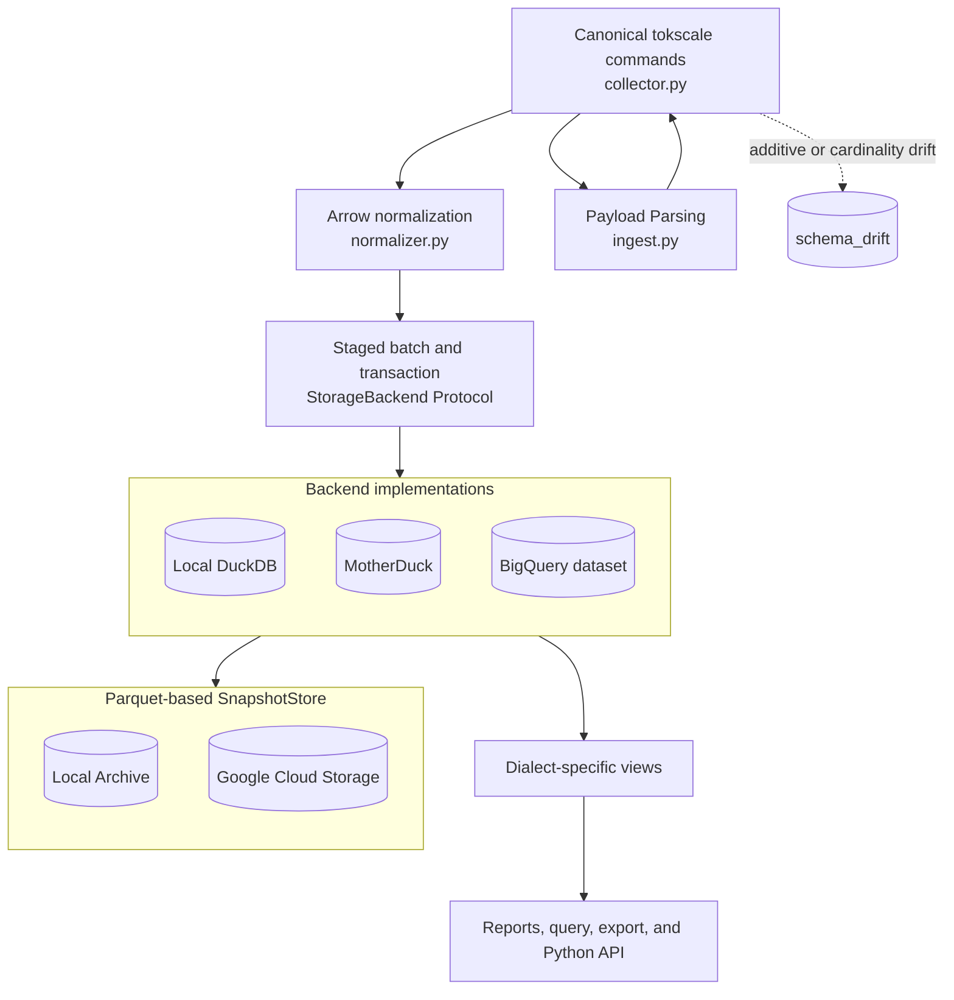

<!-- SPDX-FileCopyrightText: 2026 Israel Flores-Arbolay -->
<!-- SPDX-License-Identifier: AGPL-3.0-only -->

# Contributing to UsageBassoon

Thank you for helping improve UsageBassoon. UsageBassoon is a Python CLI and library that persists `tokscale` token-usage data currently supporting DuckDB, MotherDuck, and BigQuery with optional local and GCS parquet snapshots.

Contributions should preserve the project’s central promise: token-usage history is durable, queryable, idempotent, and safe to collect from any agentic host environment including ephemeral containers.

*Please keep credentials, raw usage exports, and other private operational data out of commits and issues.*

## Before you begin

For a substantial feature, behavior change, schema change, new backend, or architectural refactor, *open the appropriate issue first* so the design can be discussed. Use the issue forms in [`.github/ISSUE_TEMPLATE/`](.github/ISSUE_TEMPLATE/).

> [!IMPORTANT]
> Every pull request requires a completed Contributor License Agreement (CLA). Read the repository copy in [`CLA.md`](CLA.md) and the published CLA text in the [UsageBassoon CLA Gist](https://gist.github.com/israelflores8789/076c8d49b840ebe713e925bd0c2bf6a8). We use [CLA Assistant](https://github.com/cla-assistant/cla-assistant) to handle acceptance on pull requests. Follow its prompt and resolve the `license/cla` check before requesting merge; a pull request cannot be merged while that check is failing or incomplete.

**All pull requests must target `main`.** Do not target `dev` or another branch. The repository’s pull-request CI, review rules, CLA check, and release process are organized around `main`.

When reporting a bug or failed integration, run `bassoon doctor` and include its default sanitized output. *Never* publish `bassoon doctor --raw` output, raw query results, snapshots, configuration files, credentials, or unredacted collection logs.

## Getting started

### Prerequisites

| Tool                             | Purpose                                                      |
|:---------------------------------|:-------------------------------------------------------------|
| Git                              | Source control and branch management                         |
| Python 3.12+                     | Supported runtime and development interpreter                |
| [uv](https://docs.astral.sh/uv/) | Dependency and environment management                        |
| [just](https://just.systems/)    | Repository task runner                                       |
| pre-commit                       | Recommended local formatting, YAML, spelling, and workflow checks |
| VS Code                          | Optional; repository recommendations and settings are included |

Cloud credentials and access to the dedicated BigQuery and GCS test resources are needed only for the opt-in live integration tests. Do *not* use personal or production resources for those tests.

### Clone and install

Clone your fork or working copy, then install the locked development environment:

```bash
git clone https://github.com/israelflores8789/usagebassoon.git
cd usagebassoon
uv sync --locked --all-extras --dev
uv run pre-commit install
```

`just install-dev` is also available as a repository convenience command. Run `just --list` to see all available recipes.

Verify the development environment:

```bash
uv run bassoon --help
just --list
```

### Editor setup

VS Code users should open the repository root and accept the recommended extensions in [`.vscode/extensions.json`](.vscode/extensions.json). They include Python, Debugpy, Pyrefly, Ruff, TOML, `justfile`, and Typos support. The project intentionally recommends Ruff instead of Black and Pyrefly instead of Pylance or Pyright.

[`.vscode/settings.json`](.vscode/settings.json) disables a competing Python language server, enables Ruff as the formatter, formats Python on save, organizes imports with Ruff, applies Ruff fixes on save, and associates the standard JSON Schema with `pyproject.toml`. Other editors are welcome; use the same command-line checks described below.

## Repository map

The repository is organized around a small, explicit ingest pipeline:

```text
usagebassoon/
├── src/usagebassoon/       # CLI, collection, validation, normalization, and library API
│   ├── cli/                # Typer commands and terminal reports
│   ├── parsers/            # Typed tokscale payload parsers
│   ├── contracts/          # Versioned JSON schema contracts
│   ├── backends/           # DuckDB, MotherDuck, BigQuery, and GCS adapters
│   └── sql/                # Paired DuckDB and BigQuery DDL and views
├── tests/                  # Sanitized fixtures and automated coverage
├── .github/                # CI, release automation, and issue forms
├── .vscode/                # Recommended extensions and workspace settings
├── pyproject.toml          # Packaging, tooling, dependencies, and Hatch version configuration
└── justfile                # Development, test, and release commands
```

Keep changes within these boundaries. New persistence behavior should use the `StorageBackend` abstraction and canonical Arrow tables. CLI commands should consume dialect-specific views and *never* embed non-portable SQL.

## Canonical data flow

Presently, four **canonical `tokscale` commands** supply the collection pipeline:

1. `tokscale models --json --group-by client,session,model --since <YYYY-MM-DD> --until <YYYY-MM-DD>` is authoritative for date-filtered daily token statistics at client, session, and model grain.
2. `tokscale report --json --no-summarize --since <YYYY-MM-DD> --until <YYYY-MM-DD>` is authoritative for session metadata. Non-deterministic summary fields are not persisted.
3. `tokscale graph` is authoritative for daily activity and candidate dates. Its totals are not reconciled against daily model totals.
4. `tokscale pricing <model-id> --json` is authoritative for the pricing rates observed for each active model on each processed day.

The `collector.py` module:
- resolves and invokes `tokscale`,
- uses graph candidate dates to request daily models,
- fetches pricing for models present in those facts, and
- collects report metadata for the same period.

The raw JSON payload is validated against a versioned contract and parsed into typed objects.



Required-field absence from the tokscale payload is a collection error. Unknown fields, changed cardinalities, and compatible additive changes are recorded as schema-drift events and surfaced to users while the tolerant reader continues where safe, prioritizing token persistence where possible.

The normalizer computes canonical derived columns and produces Arrow tables. The storage backend stages the batch and applies one current-state upsert or `MERGE` per collection run; absent later rows are *never* deleted. Views calculate derived costs and report data in the selected SQL dialect.

## Architectural mandates

The following are design *constraints*, not optional:

- **Upsert-only.** Collection merges may insert new natural keys and update changed current-state rows, but must never delete usage facts, price history, audit records, reconciliation results, schema-drift events, or snapshot artifacts. Deletion must be an *intentional* act of the user.
- **Idempotency.** Repeating a collection from one or many ephemeral environments must be safe. Match facts by their documented natural keys, update only changed rows, and make retries repeatable without consequence.
- **Collection Atomicity.** Stage the complete normalized Arrow batch *before* persistence, then use one transaction or equivalent backend-native atomic operation for the collection run. A partial batch must *never* appear as a successful run. Unsuccessful transactions must *always* be rolled back safely.
- **Arrow Normalization.** Normalization and derived columns belong *before* storage. `StorageBackend`s accept and return canonical Arrow tables so DuckDB, MotherDuck, BigQuery, and future adapters share semantics.
- **SQL Dialect Agnostism.** Maintain the paired DuckDB and BigQuery DDL and views. CLI commands should query the appropriate **dialect-specific view** and *never* contain non-portable ad hoc SQL. SQLGlot `sql_parity` test coverage must pass for dialect changes.
- **Canonical Command Authority.** `tokscale graph` provides candidate dates and activity only; `tokscale models` provide daily statistics; `tokscale report` provides session metadata; `tokscale pricing` provides observed rates. Do *not* invent a second source of truth.
- **Separated User-Curated Data.** Data associated with `basson tag` and `bassoon note` are user-owned data. Collection, normalization, restore, and snapshot workflows must not overwrite or silently remove them.
- **Private, Atomic Snapshots.** A snapshot is publishable only after *complete* table coverage and a *complete* catalog manifest. `bassoon restore` validates membership, integrity, and destination compatibility before appending data. Snapshots contain raw data at-rest which can contain private data and is *not* meant for public export.
- **Tolerant Schema Drift.** Required-field absence from tokscale's JSON payload should fail clearly, but additive fields and compatible shape changes should be recorded, reported, and investigated without blocking safe collection.
- **Declarative Configuration:** One TOML configuration should describe and manage all of UsageBassoon's behavior and support multiple data warehouses and snapshot archive destinations.
- **Protect Privacy by Default.** Never place potentially personal information (e.g. session IDs, unsanitized workspace paths, etc) in source control, fixtures, issue reports, or pull requests. *Always* prefer sanitized `basson doctor` output for diagnostics and bug reporting, obfuscate raw exports, and keep snapshots private.

## Golden fixture policy

> [!CAUTION]
> Do **NOT** edit, regenerate, or replace the committed JSON files in `tests/fixtures/` to make a failing test pass. A fixture failure is evidence of a parser, normalizer, contract, or compatibility regression and must be investigated.

The fixtures are sanitized, versioned, real `tokscale` JSON captures and part of the test contract. Do **not** change identifiers, values, dates, expected counts, or filenames casually. If an intentional `tokscale` contract or fixture change is required, *coordinate with a maintainer* and use a focused pull request that explains the exact `tokscale` version, capture date, structural change, semantic impact, and related contract or test changes. **Never** regenerate fixtures during a routine test run.

## Testing and quality checks

Run the core checks before opening a pull request:

```bash
just ci
just lint
just typecheck
just spell
uv run pre-commit run --all-files
```

The project separates local tests from SQL dialect-parity tests:

| Check                     | Purpose                                                      |
|:--------------------------|:-------------------------------------------------------------|
| `just test-unit`          | Runs the local unit and DuckDB test suite, excluding `sql_parity` |
| `just test -m sql_parity` | Runs the SQLGlot dialect-parity and replay tests separately  |
| `just ci`                 | Runs the project’s standard hermetic CI gate                 |
| `just lint`               | Runs Ruff lint and format checks                             |
| `just typecheck`          | Runs strict Pyrefly checks                                   |
| `just spell`              | Runs the Typos spelling check                                |
| `just check-dist`         | Builds distributions and validates them with Twine           |

`sql_parity` is a required separate check even when `just test-unit` passes. SQL changes must update both dialects and include parity coverage.

Use focused tests while developing:

```bash
just test tests/test_parsers.py
just test -m "not (bigquery_live or gcs_live or sql_parity)"
uv run pytest tests/test_merge.py -q # just recipes preferred
```

Run cloud integration tests only with the dedicated disposable resources and appropriate credentials:

```bash
just test-bq-live <test-name> [reset]
just test-gcs-live <test-name>
```

- BigQuery live tests are restricted to the `usagebassoon_it` dataset.
- GCS live tests are restricted to `gs://usagebassoon-test-snapshots-gen-lang-client-0670612427`.

> [!WARNING]
> **Never** point live tests at a personal or production dataset or bucket, and **never** commit credentials, local configuration, database files, snapshots, logs, or unsanitized raw usage exports.

## Code conventions

Python contributions must
- target **Python 3.12+**,
- use complete type annotations,
- follow **Google-style docstrings**, and
- pass the project’s **Ruff** and **Pyrefly** configuration.
Prefer PEP 695 syntax for new generic declarations and type aliases. Do *not* suppress diagnostics, introduce implicit `Any`, or add bare generic types to make a check pass.

Use the existing package boundaries and public API conventions. User-facing CLI or Python API changes need tests and documentation. Schema, DDL, or view changes need corresponding updates for both SQL dialects and the separate `sql_parity` tests. Keep comments concise and document the invariant or design decision they protect.

## Areas for contribution

UsageBassoon is intentionally modular, and contributions are welcome with key needs in these areas:

- **Extend backend support** to include more data analytic warehouses including:
  - AWS Redshit,
  - Azure Fabric,
  - Snowflake, and
  - Databricks.
- **Extend snapshot support** to include additional object storage archive backends including:
  - AWS S3,
  - Azure Blob Storage,
  - Cloudflare R2, and
  - Backblaze B2.
- **Extend user-curation** to allow for multiple tags per session while preserving source, client, workspace, and session scoping.
- **Platform-native releases** extending the GitHub `Release` workflow to include:
  - Debian-native `.deb` packages,
  - RedHat-native `.rpm` packages,
  - a Windows installer, and
  - a macOS `.dmg`.
- **Improve collection resilience:**
  - Add a local cache that allows UsageBassoon to be resilient against network hiccups maintaining the idempotency and atomicity standards.
  - Investigate and harden against tokscale hangs when LiteLLM calls do not resolve; improve timeouts, cancellation, diagnostics, and recovery behavior.
- **Support CSV report output** as first-class with a `--csv` flag, and maintain support for the `--sanitize` flag consistent with UsageBassoon’s privacy and obfuscation rules.
- **UsageBassoon-Native token usage collection:**
  - Pricing data is currently snapshot over time from Tokscale which uses LiteLLM. A downstream major version should bring this in-house with an API call to either LiteLLM or Models.dev.
  - UsageBassoon v1 currently relies on Tokscale for token usage aggregation. A downstream major version should make this native to UsageBassoon with a schema we can control more closely. One option is to investigate porting Tokscale’s MIT-licensed Rust binary making it a native tool call. Token aggregation itself should always be driven by a compiled, memory-safe language like Rust to limit execution time. The user-facing project remains in Python which aligns with the data science utility and expectations.
- **Formalize documentation** with a static GitHub.io site as the CLI, library API, storage backends, and reporting capabilities grow.

For a substantial item, open an issue before implementation so the data model, privacy impact, dialect behavior, and migration path can be reviewed.

## Submitting changes

Use this five-part workflow for every contribution.

**1. Discuss the change.** Open the appropriate issue for a non-trivial bug, feature, schema, backend, or architectural change. Include the user problem and constraints. For a small, self-contained documentation or test fix, you may proceed directly to a branch.

**2. Fork and branch.** Fork the repository, clone your fork, update `main`, and create a descriptive branch:

```bash
git switch main
git pull --ff-only origin main
git switch -c feat/<your-feat-name>
```

Use a `fix/`, `feat/`, `docs/`, `test/`, `refactor/`, or similarly descriptive branch prefix.

**3. Implement and verify.** Keep the change focused. Add or update tests, documentation, contracts, views, and migrations as needed. Run `just test-unit`, `uv run pytest -m sql_parity`, `just lint`, `just typecheck`, and `just spell` as applicable. Use the dedicated live-test recipes only when you have authorized access to the fixed test resources. You can also point them to your own test resources.

**4. Commit and update the changelog.** Use concise [Conventional Commits](https://www.conventionalcommits.org/) with an imperative subject that explains the change:

```text
feat: add CSV report output
fix: prevent collection from hanging on an unresolved tokscale process
test: add SQLGlot BigQuery/DuckDB parity coverage
docs: document snapshot restore requirements
refactor: separate Arrow normalization from backend persistence
chore: update release workflow dependencies
```

Keep commits focused on one logical change. Update `CHANGELOG.md` in the same pull request for notable user-facing behavior, API, CLI, schema, storage, or compatibility changes.

> [!CAUTION]
> `CHANGELOG.md` is consumed by the `Release` workflow. Follow [Keep a Changelog](https://keepachangelog.com/en/1.1.0/) exactly, write entries for users rather than implementation details, and do not manually rewrite released sections.

Add notable changes under `## [Unreleased]`, using `###Added`, `Changed`, `Deprecated`, `Removed`, `Fixed`, or `Security` as appropriate. Internal-only `test:`, `docs:`, and `chore:` changes normally do not need an entry. For a release, maintainers use `just release VERSION` to rotate `Unreleased` into a dated version section.

Example:

```markdown
## [Unreleased]

### Added

- Add CSV report output with the same default obfuscation behavior as other exports.

### Fixed

- Retry a collection after a transient backend connection failure.

## [1.0.0] - 2026-09-21

### Added

- Add the first stable release of UsageBassoon.
```

**5. Open the pull request.** Push the branch to your fork and open a pull request with `main` as the base branch:

```bash
git push origin feat/short-description
```

The pull request description should include:

- a concise summary and motivation;
- the implementation and architectural impact;
- tests and exact commands run, including the separate `sql_parity` check when relevant;
- documentation, changelog, contract, DDL, view, or migration changes;
- privacy, compatibility, or operational risks;
- any follow-up work that should not block the pull request.

> [!IMPORTANT]
> Before requesting review, **confirm that the CLA Assistant check passes**, the pull request targets `main`, required local checks are green, and no private data or credentials are included. Respond to review feedback with focused commits and keep the branch up to date with `main`.
>
> As a reminder, you can read the [Contributor License Agreement](CLA.md) here.

## Release process (maintainers)

Releases are prepared through a pull request to `main` and published only from a version tag on a commit that is already on `main`.

### Prepare the release pull request

Keep `## [Unreleased]` current as normal changes merge. When a release is ready, maintainers run the helper on a clean working tree:

```bash
just release 1.0.0
```

The command validates the version, moves the existing `Unreleased` entries into a dated version section, and leaves a new `Unreleased` heading.

- Review the generated changelog,
- run `just ci`,
- run `just test -m sql_parity`,
- run `just test-bq-live` and `just test-gcs-live` if you have appropriate access to the live test resources or your own,
- run `just check-dist`, then
- open a release pull request targeting `main`.

> [!IMPORTANT]
> Do not edit a version string in `pyproject.toml`. The project uses Hatchling with `hatch-vcs`, and `[tool.hatch.version] source = "vcs"` derives the package version from the latest matching Git tag. If a clone is shallow or missing tags, run `git fetch --tags` before building.

> [!NOTE]
> Release tags follow [Semantic Versioning](https://semver.org/) using `vMAJOR.MINOR.PATCH`, with an optional prerelease suffix such as `v0.2.0rc1`. Note, the `v` prefix is **required**.


### Merge and publish

The release sequence is:

1. Open the release pull request against `main`.
   - CLA Assistant,
   - pull-request `CI` workflow,
   - the separate `sql_parity` check, and
   - code review **must all pass**.
2. After approval, maintainers merge the pull request into `main`.
3. `CI Live` workflow runs and **must** complete successfully for the resulting `main` commit. `CI Live` repeats the hermetic checks and runs *protected* BigQuery and GCS integration tests.
4. If `CI Live` fails, do **not** tag the commit. `Release` will reject it. Diagnose the failure, and repeat steps 1-3.
5. After `CI Live` succeeds, check out the exact merged `main` commit and create an annotated release tag. **Only authorized maintainers** can push protected release tags:

```bash
git switch main
git pull --ff-only origin main
git fetch --tags
git tag -a v1.0.0 -m "v1.0.0"
git push origin v1.0.0
```

The tag points to `main`; pushing it does not replace or bypass the pull-request workflow.

6. The `Release` workflow verifies that the tag is on `main` and that a successful `CI Live` run exists for the exact tagged commit. It:
   - reruns the hermetic tests,
   - runs the build,
   - verifies that the Hatchling-derived version matches the tag, and
   - publishes to PyPI using trusted publishing.
7. After PyPI publication succeeds, the workflow creates the GitHub release from the matching `CHANGELOG.md` section and attaches the built distributions.

Do **not** force-move, delete, or reuse a protected release tag. If a published release needs a correction, prepare a new version or prerelease tag and follow the same process.

## License

UsageBassoon is licensed under the [GNU Affero General Public License v3.0 only](LICENSE). By contributing, you agree to the terms of [`CLA.md`](CLA.md), including its copyright and patent grants. New source files should carry the repository’s SPDX copyright and license identifiers.

---

*Thank you for helping make UsageBassoon a dependable home for token-usage history.*
