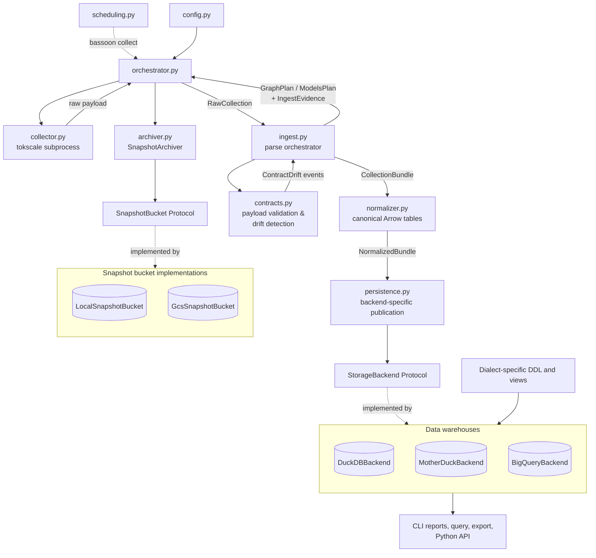

<!-- SPDX-FileCopyrightText: 2026 Israel Flores-Arbolay -->
<!-- SPDX-License-Identifier: AGPL-3.0-only -->

# Contributing to UsageBassoon

Thank you for helping improve UsageBassoon. UsageBassoon is a Python CLI and library that persists `tokscale` token-usage data currently supporting DuckDB, MotherDuck, and BigQuery with optional local and GCS parquet snapshots.

Contributions should preserve the project’s central promise: token-usage history is durable, queryable, idempotent, and safe to collect from any agentic host environment including ephemeral containers.

*Please keep credentials, raw usage exports, and other private operational data out of commits and issues.*

## Before you begin

For a substantial feature, behavior change, schema change, new backend, or architectural refactor, *open the appropriate issue first* so the design can be discussed. Use the issue forms in [`.github/ISSUE_TEMPLATE/`](.github/ISSUE_TEMPLATE/).

> [!IMPORTANT]
> Every pull request requires a completed Contributor License Agreement (CLA). Read the repository copy in [`CLA.md`](CLA.md) and the published CLA text in the [UsageBassoon CLA Gist](https://gist.github.com/israelflores8789/076c8d49b840ebe713e925bd0c2bf6a8). We use [CLA Assistant](https://github.com/cla-assistant/cla-assistant) to handle acceptance on pull requests. Follow its prompt and resolve the `license/cla` check before requesting merge; a pull request cannot be merged while that check is failing or incomplete.

**All pull requests must target `main`.** Do not target `dev` or another branch. The repository’s pull-request CI, review rules, CLA check, and release process are organized around `main`.

When reporting a bug or failed integration, run `bassoon doctor` and include its default sanitized output. *Never* publish `bassoon doctor --raw` output, raw query results, snapshots, configuration files, credentials, or unredacted collection logs.

## Getting started

### Prerequisites

| Tool                             | Purpose                                                      |
|:---------------------------------|:-------------------------------------------------------------|
| Git                              | Source control and branch management                         |
| Python 3.12+                     | Supported runtime and development interpreter                |
| [uv](https://docs.astral.sh/uv/) | Dependency and environment management                        |
| [just](https://just.systems/)    | Repository task runner                                       |
| pre-commit                       | Recommended local formatting, YAML, spelling, and workflow checks |
| VS Code                          | Optional; repository recommendations and settings are included |

Cloud credentials and access to the dedicated BigQuery, MotherDuck, and GCS test resources are needed only for the opt-in live integration tests. Do *not* use personal or production resources for those tests. The BigQuery and GCS permissions UsageBassoon requires are documented in the README.

### Clone and install

Clone your fork or working copy, then install the locked development environment:

```bash
git clone https://github.com/israelflores8789/usagebassoon.git
cd usagebassoon
uv sync --locked --all-extras --dev
uv run pre-commit install
```

`just install-dev` is also available as a repository convenience command. Run `just --list` to see all available recipes.

Verify the development environment:

```bash
uv run bassoon --help
just --list
```

### Editor setup

VS Code users should open the repository root and accept the recommended extensions in [`.vscode/extensions.json`](.vscode/extensions.json). They include Python, Debugpy, Pyrefly, Ruff, TOML, `justfile`, and Typos support. The project intentionally recommends Ruff instead of Black and Pyrefly instead of Pylance or Pyright.

[`.vscode/settings.json`](.vscode/settings.json) disables a competing Python language server, enables Ruff as the formatter, formats Python on save, organizes imports with Ruff, applies Ruff fixes on save, and associates the standard JSON Schema with `pyproject.toml`. Other editors are welcome; use the same command-line checks described below.

## Repository map

The repository is organized around an explicit collection, ingest, normalization, persistence, and archival pipeline:

```text
usagebassoon/
├── src/usagebassoon/
│   ├── cli/                # Typer commands and terminal-facing presentation
│   ├── parsers/            # Typed parsers for individual tokscale payload kinds
│   ├── contracts/          # Versioned JSON schema contracts
│   ├── backends/           # StorageBackend protocol + data warehouse adapters
│   ├── buckets/            # SnapshotBucket protocol + object storage adapters
│   ├── sql/                # Dialect-specific DDL, views, and BigQuery compaction script
│   │   ├── duckdb/         # ddl.sql, views.sql (also serves MotherDuck)
│   │   └── bigquery/       # ddl.sql, views.sql, compaction.sql
│   ├── collector.py        # tokscale subprocess management
│   ├── orchestrator.py     # Top-level data shuttler
│   ├── ingest.py           # Contract validation and parsing coordinator
│   ├── contracts.py        # Raw payload validation and schema-drift detection
│   ├── normalizer.py       # Parsed payload to canonical Arrow-table normalization
│   ├── persistence.py      # Normalized batch publication to data warehouses
│   ├── storage_model.py    # Shared logical keys and observation tie-break rules
│   ├── schema_assets.py    # Ordered packaged SQL for schema initialization
│   ├── collection_lock.py  # Local user-environment collection exclusion
│   ├── curation.py         # User-owned tags and notes
│   ├── diagnostics.py      # Doctor checks and read-only diagnostic queries
│   ├── archiver.py         # Portable Parquet snapshot and restore coordination
│   ├── audit.py            # Importable backend/archive run and source evidence
│   ├── snapshot/           # Snapshot feature implementation; never imports archiver
│   │   ├── format.py       # Immutable documents, readers, forward transformations
│   │   ├── catalog.py      # Shared policy, reservations, retention, pins, repair
│   │   ├── reader.py       # Global selection and verified file/batch access
│   │   └── restore.py      # Provider-neutral recovery preparation and restore
│   ├── config.py           # config.toml manager
│   ├── scheduling.py       # Scheduled collection execution
│   ├── api.py              # Public Python query and connection API
│   └── frames.py           # Arrow conversion to pandas or polars frames
├── tests/                  # Test suite and regression coverage
│   └── fixtures/           # Sanitized golden fixtures; do NOT modify
├── .github/                # CI, release automation, and issue forms
├── .vscode/                # Recommended extensions and workspace settings
├── .pre-commit-config.yaml # Convenient formatting, spell check, and yaml lint enforcement
├── config.schema.json      # Official schema for user's config.toml
├── pyproject.toml          # Hatchling, Twine, Pytest, & project configurations
└── justfile                # Convenient command runner
```

Keep changes within these boundaries. New collection behavior should preserve the separation between acquisition, ingest validation/parsing, normalization, persistence, and archival. New persistence behavior should use the `StorageBackend` abstraction and canonical Arrow tables. New snapshot storage providers should implement `SnapshotBucket`. CLI commands should consume dialect-specific views and *never* embed non-portable SQL.

## Canonical data flow

Presently, four **canonical `tokscale` commands** supply the collection pipeline:

1. `tokscale models --json --group-by client,session,model --since <YYYY-MM-DD> --until <YYYY-MM-DD>` is authoritative for date-filtered daily token statistics at client, session, and model grain.
2. `tokscale report --json --no-summarize --since <YYYY-MM-DD> --until <YYYY-MM-DD>` is authoritative for session metadata. Non-deterministic summary fields are not persisted.
3. `tokscale graph` is authoritative for candidate dates only. No activity table is persisted, and its totals are not reconciled against daily model totals.
4. `tokscale pricing <model-id> --json` is authoritative for the pricing rates observed for each active model on each processed day.

`orchestrator.py` owns the collection workflow, and it:
- resolves collection configuration and bounds,
- coordinates raw payload acquisition through `collector.py`, and
- uses ingest planning results to request date-filtered models, pricing, and report payloads.

`collector.py` is the sole interface to the `tokscale` subprocess, and it:
- returns raw acquisition outcomes but
- does not parse or persist them.

`ingest.py` validates each payload against its versioned contract before parsing it into typed objects, and it:
- produces `GraphPlan` and `ModelsPlan` to guide subsequent acquisition,
- constructs `IngestEvidence` from those acquisition outcomes, and
- returns a validated `CollectionBundle`.

Required `graph` and `models` payloads must be valid for collection to proceed. Token usage is prioritized, so `report` and `pricing` failures are conditionally tolerated when doing so preserves otherwise valid token facts.


```mermaid
flowchart TD
      SCH[scheduling.py] -. bassoon collect .-> ORCH[orchestrator.py]
      CFG[config.py] --> ORCH

      ORCH --> COL[collector.py<br/>tokscale subprocess]
      COL -->|raw payload| ORCH
      ORCH -->|RawCollection| ING[ingest.py<br/>parse orchestrator]

      ING -->|GraphPlan / ModelsPlan<br/>+ IngestEvidence| ORCH
      ING -->|CollectionBundle| NORM[normalizer.py<br/>canonical Arrow tables]

      ING --> CON[contracts.py<br/>payload validation &<br/>drift detection]
      CON -->|ContractDrift events| ING

      NORM -->|NormalizedBundle| PERSIST[persistence.py<br/>backend-specific publication]
      PERSIST --> BACKEND[StorageBackend Protocol]

      subgraph WAREHOUSE[Data warehouses]
          direction TD
          DUCK[(DuckDBBackend)]
          MD[(MotherDuckBackend)]
          BQ[(BigQueryBackend)]
      end
      BACKEND -. implemented by .-> WAREHOUSE
      SQL[Dialect-specific DDL and views] --> WAREHOUSE

      ORCH --> ARCH[archiver.py<br/>SnapshotArchiver]
      ARCH --> BUCKET[SnapshotBucket Protocol]

      subgraph BUCKETS[Snapshot bucket implementations]
          direction TD
          LOCAL[(LocalSnapshotBucket)]
          GCS[(GcsSnapshotBucket)]
      end
      BUCKET -. implemented by .-> BUCKETS

      WAREHOUSE --> OUT[CLI reports, query, export,<br/>Python API]
```

Required-field absence from a required payload is a collection error. Unknown fields, changed cardinalities, and compatible additive changes are recorded as schema-drift events and surfaced to users. The tolerant reader continues only where doing so is safe and preserves valid token history.

`normalizer.py` computes canonical derived columns and produces Arrow tables, and it assigns each observation row a stable `event_id` before any persistence retry.

`persistence.py` prepares the normalized batch and delegates publication to the backend: transactional upserts for DuckDB/MotherDuck, or concurrent replay-safe raw appends for BigQuery with the collection ledger written last. Absent later rows are *never* deleted. Dialect-specific SQL views calculate costs and provide report and query data.

`archiver.py` independently orchestrates the `snapshot/` feature. Backends stream canonical Arrow batches at one consistent read point; the archiver incrementally writes private temporary Parquet files, and `SnapshotBucket` implementations transfer files with bounded memory. `snapshot/reader.py` downloads and validates before `snapshot/restore.py` delegates atomic publication to the backend. `audit.py` queries the installed dialect-specific `audit_sources` view; snapshot audits reuse the packaged DuckDB view over verified Parquet in a private memory-limited connection with disk spilling; Python retains source summaries rather than historical run IDs. `storage_model.py` stays in the core library: it owns canonical Arrow schemas, natural keys, observation ordering, and the portable data version shared by normalization, persistence, curation, compaction, and recovery.

## Architectural mandates

The following are design *constraints*, not optional. See [`AGENTS.md`](AGENTS.md) for more exhaustive detailed decision reasoning; read it before changing persistence, compaction, schema, snapshot, or curation behavior.

- **Upsert-only.** UsageBassoon *only* appends, dedups, and updates usage data. It *never* deletes data from a data warehouse. Data deletion must be an *intentional* act of the user.
- **Idempotency.** Repeating a collection from one or many ephemeral environments must be safe without consequence. This means duplicates are tolerated if there is a means to safely dedup records.
- **Atomicity.** Wherever possible, updates to a data warehouse or archive are atomic. For Direct Transactional Upsert warehouses, transactions must be atomic. For Append-and-Compact warehouses, compaction transactions must be atomic. Unsuccessful transactions must *always* be rolled back safely. For snapshot archives, immutables directories, including Parquet archives and the manifest, must be created atomically.
- **Dual-Architecture Backends.** UsageBassoon categorizes data warehouses into two broad architectures:
  - **Direct Transactional Upsert:** For data warehouses where batched transactions is latency-cheap, collection data is normalized and batched into one atomic transaction. (Implemented: DuckDB, MotherDuck)
  - **Append-and-Compact:** For data warehouses that reward "append-and-forget" ingestion, collection data is persisted to "raw" ephemeral append-only tables and deduped through scheduled compaction to "gold" tables. (Implemented: BigQuery)
- **Backend Agnosticism.** UsageBassoon is built to be extensible. Data warehouse provider-specific machinery is in the `backends/` subpackage and implements the `StorageBackend` protocol. Dialect-specific SQL scripts are in their dedicated `sql/<dialect>/` directories and *must* be kept functionally in sync between dialects (the `sql_parity` test coverage, based on SQLGlot, enforces this). Data warehouse queries and parsed Tokscale payload is normalized in backend-agnostic Arrow tables.
- **Bucket Agnosticism.** Object Storage provider-specific machinery is in the `buckets/` subpackage and implements the `SnapshotBucket` protocol.
- **Interoperability.** UsageBassoon implements two user axioms that must never be broken:
  - *A user should be able to snapshot their data and move it to whatever data warehouse they wish.*
  - *A user should be able to move an existing snapshot archive to whatever object store they wish.*
- **Canonical Command Authority.** The following Tokscale commands are canonical sources-of-truth for usage payload collection:
  - `tokscale graph` provides candidate dates for collection only
  - `tokscale models` provide daily statistics at the (client, session, model) level
  - `tokscale report` provides session metadata
  - `tokscale pricing` provides observed model rates
- **Tolerant Collection Payload.** UsageBassoon prioritizes token usage persistence and tolerates payloads that can be gathered later in the event of an error. Mandatory canonical commands include `tokscale models` and `tokscale graph`.
- **Tolerant Schema Drift.** UsageBassoon disciminates Tokscale's JSON payload into required and tolerated fields. Tolerated fields generate "schema drift events" that are surfaced through `bassoon doctor`. UsageBassoon also attempts to reconcile certain fields mathematically to verify consistency. Errors here are generally tolerated but generate "reconciliation issues", also surfaced through `bassoon doctor`.
- **Atomic Snapshots.** A snapshot is publishable only after *complete* table coverage and a *complete* immutable manifest and completion record, and it must include un-compacted raw observations through canonical state, for append-and-compact backends.
- **Declarative Configuration:** One TOML configuration should describe and manage all of UsageBassoon's behavior and support multiple data warehouses and snapshot archive destinations.
- **Protect Privacy by Default.** UsageBassoon attempts to protect sensitive user data by offering means to obfuscate. UsageBassoon also automatically obfuscates commands likely to be shared publicly (e.g. `bassoon doctor` and `bassoon export`). *Never* place potentially personal information (e.g. session IDs, unsanitized workspace paths, etc) in source control, fixtures, issue reports, or pull requests. *Always* prefer sanitized `bassoon doctor` output for diagnostics and bug reporting, obfuscate raw exports, and keep snapshots private.

## Persistence architectures

UsageBassoon chooses a persistence architecture according to how cheaply a warehouse handles mutation. Both architectures share the same Arrow model, natural keys, ordering rules, underlying data model, and report views.

| Architecture | How it works | Current backends |
|:-------------|:-------------|:-----------------|
| Direct transactional upsert | Each normalized batch upserts current-state tables in a bounded transaction; audit and debug streams append. | DuckDB, MotherDuck |
| Append-and-compact | Collection appends immutable observations to raw tables. Canonical views combine gold with retained raw rows. Scheduled transactional compaction folds raw into gold. Curation tables have tombstones for delete. | BigQuery |

Collection and curation on an append-and-compact backend never mutate raw or gold tables. *Only* scheduled compaction and atomic restore write gold. Concurrent collectors, including those sharing a `source_id`, are safe by idempotent appends and read-time deduplication.

A new backend contribution must:
- state which architecture it uses and why, validating the warehouse's write and concurrency behavior first (Redshift and Microsoft Fabric are candidate append-and-compact fits);
- implement `StorageBackend` over canonical Arrow tables and provide native DDL and views functionally equivalent to other dialects;
- keep a non-null `source_id` on every base table and include it in the natural key of every source-scoped current-state table;
- preserve the shared ordering policy, tombstone semantics, and schema init/marker behavior;
- support consistent snapshot capture and atomic restore into an empty destination; and
- add structural and synthetic parity test coverage plus focused live tests against a disposable resource.

## Schema, SQL, and compaction changes

- Update the DuckDB and BigQuery DDL and views together, and update the `sql_parity` tests. Backend-specific raw tables, canonical ingestion views, and compaction SQL differ by design; shared logical tables and report views must not.
- Never reshape an existing table with `CREATE TABLE IF NOT EXISTS`. A table-shape change **requires** a schema version bump and an explicit registered migration. The BigQuery schema hash includes `compaction.sql`, so a compaction change *is* a schema change.
- Compaction changes need live BigQuery coverage. Compaction must remain idempotent, recompute affected partitions from existing gold plus retained raw rows, and commit gold and progress together.
- Never add DDL, MERGE, staging tables, or serialization to a BigQuery collection path.

## Snapshot and recovery contracts

### Snapshot contents and lifecycle

- Complete snapshots contain:
  - immutable `manifest.json`,
  - immutable `COMPLETE` artifact,
  - all immutable referenced Parquet objects, and
  - mutable portable `state.json`.
- Relative object names and hashes *define* portable contents. Provider generations are only concurrency metadata. Copies retain the ID and immutable contents.
- `catalog.json` is rebuildable.
- `control.json` owns retention, lifecycle, and reservation owner/expiry/fence. Publish, pin, and retire operates through its reservation CAS; catalogs and sidecars are projections.
- Lost ownership ends an attempt until rescheduled. Repair preserves corrupt evidence and active claims. Retirement tombstones block routine resurrection after interrupted deletion; valid immutable contents remain recoverable.

### Capture and publication

- Fenced reservations cover capture, pinning, deletion, retention, copying, and repair. Downloads try a reservation, but control-write failures cannot block verified recovery.
- Claim destinations in deterministic order before reading; renew through streaming and publication. Never retire unverified lifecycle state or remove active staging by age alone.
- Flush and sync local files and directories around atomic publication. Roll back partial cross-destination publication while claims are held; no transaction spans destinations. Retain only after every copy verifies.

### Scheduling and retention

- Manual snapshots bypass cadence and pin by default. Scheduled retention counts unpinned snapshots; keep four successful UTC weekly slots separately. Pins are exempt from both rules.
- Scheduled snapshots and weekly backups use independent native artifacts and a worker loop separate from collection. They run without collection completion or tokscale preflight. Backup health reports each role and accumulated weekly coverage; another instance cannot silently weaken archive policy.
- Deletion requires selected locations and the CLI's `DELETE` confirmation. Partial cleanup remains retired and retryable.

### Restore and recovery

- Recovery requires valid immutable manifest/completion evidence and all referenced objects, regardless of mutable lifecycle or retirement state. Management eligibility is separate; verified provenance remains inspectable when compatibility is unsupported.
- Validate every registered intermediate output contract, required fields, and semantic validator in an isolated candidate directory before changing maintenance or data.
- Stop all destination writers; checks and receipts are not a collection mutex. `init --restore` provisions with maintenance disabled. Restore pauses applicable maintenance and drains jobs within a bound; the native transaction rechecks emptiness, including unexpected populated tables, then commits data with a completion receipt.
- BigQuery restore stages use digest-bound logical operation IDs, unique attempt IDs, ownership labels, and expiry as a backstop. Retries drain labeled jobs and discard owned stages immediately; never infer ownership from a name prefix.
- One operation deadline covers every maintenance RPC and wait. Every exit reports known maintenance state without hiding the original failure. Plain `init` resumes maintenance explicitly.

### Versioning and compatibility

| Version responsibility | Owner | Meaning |
|---|---|---|
| Producing application version | `version.py`, Git tags | Identifies the implementation; follows application SemVer |
| Portable data-schema version | `storage_model.py` | Canonical tables, field meanings, identities, and values |
| Snapshot-format version | `snapshot/format.py` | Manifest and file packaging/interpretation |
| Physical backend schema version/hash | `schema_assets.py` | Installed native SQL, including scheduled compaction |

Persisted data and archives are public contracts: incompatible changes require a major application release; compatible additions and fixes do not automatically require one. Backend SQL upgrades and snapshot transformations use separate registries. Physical upgrades need native assets, complete previous/target hashes for each dialect, contiguous steps, and migration-ledger entries. Baseline DDL is never a fallback migration; automatic upgrades preserve maintenance pauses.

Every released format and data contract needs tested recovery: historical readers, immutable Arrow contracts, forward transformations in separate files, and semantic validators in `snapshot/format.py`. Preserve original archives, source IDs, event IDs, pricing, and curation semantics. Removing a direct reader requires a documented, tested conversion; released packages remain an emergency fallback.

### Recovery drill

- Extend existing test modules. Seed multiple sources and every logical table; relocate local/GCS copies, remove the copied index, restore to another supported backend, compare with independently derived expected data, and resume collection with source IDs preserved.
- Use only the `usagebassoon_it` BigQuery dataset, MotherDuck database, and mandated GCS test bucket. Run destructive shared-destination phases serially.

## Golden fixture policy

> [!CAUTION]
> Do **NOT** edit, regenerate, or replace the committed JSON files in `tests/fixtures/` to make a failing test pass. A fixture failure is evidence of a parser, normalizer, contract, or compatibility regression and must be investigated.

The fixtures are sanitized, versioned, real `tokscale` JSON captures and part of the test contract. Do **not** change identifiers, values, dates, expected counts, or filenames casually. If an intentional `tokscale` contract or fixture change is required, *coordinate with a maintainer* and use a focused pull request that explains the exact `tokscale` version, capture date, structural change, semantic impact, and related contract or test changes. **Never** regenerate fixtures during a routine test run.

## Testing and quality checks

Run the core checks before opening a pull request:

```bash
just ci
just lint
just typecheck
just spell
uv run pre-commit run --all-files
```

The `CI Local` workflow (`.github/workflows/ci-local.yml`) runs on pull requests targeting `main` and supports manual dispatch.

The `CI` workflow (`.github/workflows/ci.yml`) runs on pushes to `main` and `dev`, repeating the local checks and adding protected BigQuery, MotherDuck, and GCS integration tests.

The `Release` workflow requires a successful `CI` push run on `main` for the exact tagged commit.

The project separates local tests from SQL dialect-parity tests:

| Check                     | Purpose                                                      |
|:--------------------------|:-------------------------------------------------------------|
| `just test-unit`          | Runs the local unit and DuckDB test suite, excluding `sql_parity` |
| `just test -m sql_parity` | Runs the SQLGlot dialect-parity and replay tests separately  |
| `just lint`               | Runs Ruff lint and format checks                             |
| `just typecheck`          | Runs strict Pyrefly checks                                   |
| `just ci`                 | Runs the project’s standard hermetic CI gate                 |
| `just spell`              | Runs the Typos spelling check                                |
| `just check-dist`         | Builds distributions and validates them with Twine           |

`sql_parity` is a required separate check even when `just test-unit` passes. SQL changes must update both dialects and include parity coverage.

Use focused tests while developing:

```bash
just test tests/test_parsers.py
just test -m "not (bigquery_live or motherduck_live or gcs_live or sql_parity)"
uv run pytest tests/test_merge.py -q # just recipes preferred
```

Run cloud integration tests only with the dedicated disposable resources and appropriate credentials:

```bash
just test-bq-live <test-name> [reset]
just test-md-live <test-name>
just test-gcs-live <test-name>
```

- BigQuery live tests are restricted to the `usagebassoon_it` dataset.
- MotherDuck live tests are restricted to the `usagebassoon_it` database, which the recipe resets on every run.
- GCS live tests are restricted to `gs://usagebassoon-test-snapshots-<gcp-project-id>`.

> [!WARNING]
> **Never** point live tests at a personal or production dataset, database, or bucket, and **never** commit credentials, local configuration, database files, snapshots, logs, or unsanitized raw usage exports.

## Code conventions

Python contributions must
- target **Python 3.12+**,
- use complete type annotations,
- follow **Google-style docstrings**, and
- pass the project’s **Ruff** and **Pyrefly** configuration.

Prefer PEP 695 syntax for new generic declarations and type aliases. Do *not* suppress diagnostics, introduce implicit `Any`, or add bare generic types.

Use the existing package boundaries and public API conventions. User-facing CLI or Python API changes need tests and documentation. Schema, DDL, or view changes need corresponding updates for both SQL dialects and the separate `sql_parity` tests. Keep comments concise and document the invariant or design decision they protect.

## Areas for contribution

UsageBassoon is intentionally modular, and contributions are welcome with key needs in these areas:

- **Extend backend support** to include more data analytic warehouses including:
  - AWS Redshift,
  - Azure Fabric,
  - Snowflake, and
  - Databricks.
- **Extend snapshot support** to include additional object storage archive backends including:
  - AWS S3,
  - Azure Blob Storage,
  - Cloudflare R2, and
  - Backblaze B2.
- **Extend user-curation** with further organization options while preserving global client/workspace/session tags and source-scoped session notes.
- **Platform-native releases** extending the GitHub `Release` workflow to include:
  - Debian-native `.deb` packages,
  - RedHat-native `.rpm` packages,
  - a Windows installer, and
  - a macOS `.dmg`.
- **Extend automated collection** to more environments including:
  - Windows Task Scheduler,
  - non-systemd-based Linux environments, and
  - others.
  - *Current support includes* macOS (launchd), Linux (systemd), and podman/docker containers with `bassoon schedule worker`.
- **Improve collection resilience:**
  - Add a local cache that allows UsageBassoon to be resilient against network hiccups maintaining the idempotency and atomicity standards.
  - Investigate and harden against tokscale hangs when LiteLLM calls do not resolve; improve timeouts, cancellation, diagnostics, and recovery behavior.
- **UsageBassoon-Native token usage collection:**
  - Pricing data is currently snapshot over time from Tokscale which uses LiteLLM. A downstream major version should bring this in-house with scheduled API calls to either LiteLLM or Models.dev.
  - UsageBassoon v1 currently relies on Tokscale for token usage aggregation. A downstream major version should make this native to UsageBassoon with a schema we can control more closely. One option is to investigate porting Tokscale’s MIT-licensed Rust binary making it a native tool call. Token aggregation itself should always be driven by a compiled, memory-safe language like Rust to limit execution time. The user-facing project remains in Python which aligns with the data science utility and expectations.
- **Formalize documentation** with a static GitHub.io site as the CLI, library API, storage backends, and reporting capabilities grow.

For a substantial item, open an issue before implementation so the data model, privacy impact, dialect behavior, and migration path can be reviewed.

## Submitting changes

Use this five-part workflow for every contribution.

**1. Discuss the change.** Open the appropriate issue for a non-trivial bug, feature, schema, backend, or architectural change. Include the user problem and constraints. For a small, self-contained documentation or test fix, you may proceed directly to a branch.

**2. Fork and branch.** Fork the repository, clone your fork, update `main`, and create a descriptive branch:

```bash
git switch main
git pull --ff-only origin main
git switch -c feat/<your-feat-name>
```

Use a `fix/`, `feat/`, `docs/`, `test/`, `refactor/`, or similarly descriptive branch prefix.

**3. Implement and verify.** Keep the change focused. Add or update tests, documentation, contracts, views, and migrations as needed. Run `just test-unit`, `uv run pytest -m sql_parity`, `just lint`, `just typecheck`, and `just spell` as applicable. Use the dedicated live-test recipes only when you have authorized access to the fixed test resources. You can also point them to your own test resources.

**4. Commit and update the changelog.** Use concise [Conventional Commits](https://www.conventionalcommits.org/) with an imperative subject that explains the change:

```text
feat: add CSV report output
fix: prevent collection from hanging on an unresolved tokscale process
test: add SQLGlot BigQuery/DuckDB parity coverage
docs: document snapshot restore requirements
refactor: separate Arrow normalization from backend persistence
chore: update release workflow dependencies
```

Keep commits focused on one logical change. Update `CHANGELOG.md` in the same pull request for notable user-facing behavior, API, CLI, schema, storage, or compatibility changes.

> [!CAUTION]
> `CHANGELOG.md` is consumed by the `Release` workflow. Follow [Keep a Changelog](https://keepachangelog.com/en/1.1.0/) exactly, write entries for users rather than implementation details, and do not manually rewrite released sections.

Add notable changes under `## [Unreleased]`, using `### Added`, `Changed`, `Deprecated`, `Removed`, `Fixed`, or `Security` as appropriate. Internal-only `test:`, `docs:`, and `chore:` changes normally do not need an entry. For a release, maintainers use `just release VERSION` to rotate `Unreleased` into a dated version section.

Example:

```markdown
## [Unreleased]

### Added

- Add CSV report output with the same default obfuscation behavior as other exports.

### Fixed

- Retry a collection after a transient backend connection failure.

## [1.0.0] - 2026-09-21

### Added

- Add the first stable release of UsageBassoon.
```

**5. Open the pull request.** Push the branch to your fork and open a pull request with `main` as the base branch:

```bash
git push origin feat/short-description
```

The pull request description should include:

- a concise summary and motivation;
- the implementation and architectural impact;
- tests and exact commands run, including the separate `sql_parity` check when relevant;
- documentation, changelog, contract, DDL, view, or migration changes;
- privacy, compatibility, or operational risks;
- any follow-up work that should not block the pull request.

> [!IMPORTANT]
> Before requesting review, **confirm that the CLA Assistant check passes**, the pull request targets `main`, required local checks are green, and no private data or credentials are included. Respond to review feedback with focused commits and keep the branch up to date with `main`.
>
> As a reminder, you can read the [Contributor License Agreement](CLA.md) here.

## Release process (maintainers)

Releases are prepared through a pull request to `main` and published only from a version tag on a commit that is already on `main`.

### Prepare the release pull request

Keep `## [Unreleased]` current as normal changes merge. When a release is ready, maintainers run the helper on a clean working tree:

```bash
just release 1.0.0
```

The command validates the version, moves the existing `Unreleased` entries into a dated version section, and leaves a new `Unreleased` heading.

- Review the generated changelog,
- run `just ci`,
- run `just test -m sql_parity`,
- run `just test-bq-live`, `just test-md-live`, and `just test-gcs-live` if you have appropriate access to the live test resources or your own,
- run `just check-dist`, then
- open a release pull request targeting `main`.

> [!IMPORTANT]
> Do not edit a version string in `pyproject.toml`. The project uses Hatchling with `hatch-vcs`, and `[tool.hatch.version] source = "vcs"` derives the package version from the latest matching Git tag. If a clone is shallow or missing tags, run `git fetch --tags` before building.

> [!NOTE]
> Release tags follow [Semantic Versioning](https://semver.org/) using `vMAJOR.MINOR.PATCH`, with an optional prerelease suffix such as `v0.2.0rc1`. Note, the `v` prefix is **required**.

### Merge and publish

The release sequence is:

1. Open the release pull request against `main`.
   - CLA Assistant,
   - pull-request `CI Local` workflow,
   - the separate `sql_parity` check, and
   - code review **must all pass**.
2. After approval, maintainers merge the pull request into `main`.
3. `CI` workflow runs and **must** complete successfully for the resulting `main` commit. `CI` repeats the hermetic checks and runs *protected* BigQuery, MotherDuck, and GCS integration tests.
4. If `CI` fails, do **not** tag the commit. `Release` will reject it. Diagnose the failure, and repeat steps 1-3.
5. After `CI` succeeds, check out the exact merged `main` commit and create an annotated release tag. **Only authorized maintainers** can push protected release tags:

```bash
git switch main
git pull --ff-only origin main
git fetch --tags
git tag -a v1.0.0 -m "v1.0.0"
git push origin v1.0.0
```

The tag points to `main`; pushing it does not replace or bypass the pull-request workflow.

6. The `Release` workflow verifies that the tag is on `main` and that a successful `CI` run exists for the exact tagged commit. It:
   - reruns the hermetic tests,
   - runs the build,
   - verifies that the Hatchling-derived version matches the tag, and
   - publishes to PyPI using trusted publishing.
7. After PyPI publication succeeds, the workflow creates the GitHub release from the matching `CHANGELOG.md` section and attaches the built distributions.

Do **not** force-move, delete, or reuse a protected release tag. If a published release needs a correction, prepare a new version or prerelease tag and follow the same process.

## License

UsageBassoon is licensed under the [GNU Affero General Public License v3.0 only](LICENSE). By contributing, you agree to the terms of [`CLA.md`](CLA.md), including its copyright and patent grants. New source files should carry the repository’s SPDX copyright and license identifiers.

---

*Thank you for helping make UsageBassoon a dependable home for token-usage history.*
