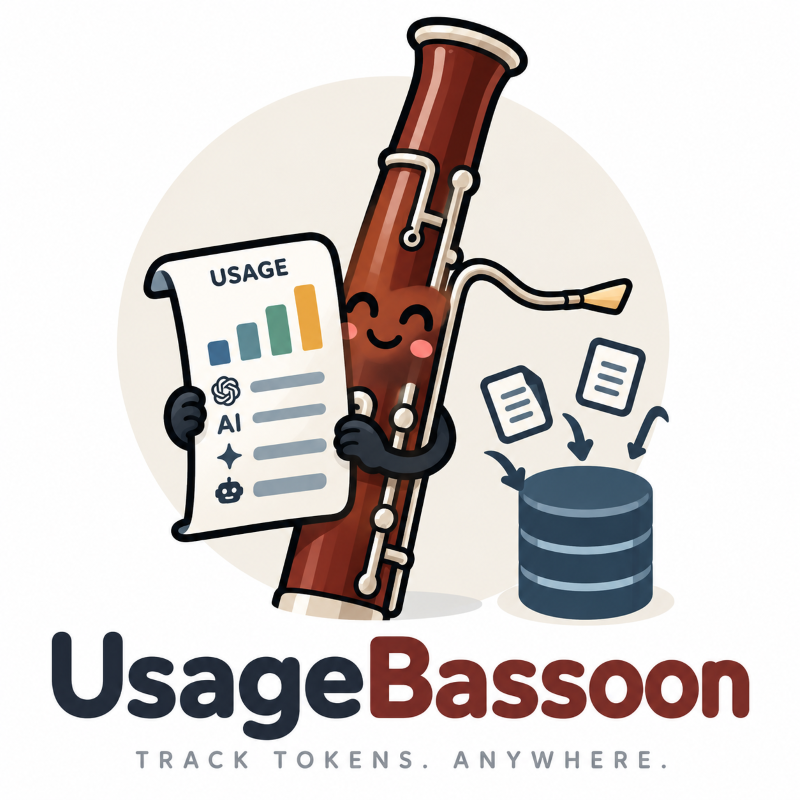

<!--
SPDX-FileCopyrightText: 2026 Israel Flores-Arbolay
SPDX-License-Identifier: AGPL-3.0-only
-->

<h1 align="center">UsageBassoon</h1>

<p align="center">
  
</p>

<p align="center"><strong>Persistent AI token usage statistics no matter where your agents live</strong></p>

<p align="center">
  <a href="https://github.com/israelflores8789/usagebassoon/actions/workflows/ci.yml"></a>
  <a href="https://pypi.org/project/usagebassoon/"></a>
  <a href="https://www.python.org/">=3.12"></a>
  <a href="https://github.com/israelflores8789/usagebassoon/blob/main/LICENSE"></a>
</p>

UsageBassoon turns [`tokscale`](https://github.com/junhoyeo/tokscale)'s stateless JSON output into durable, queryable token-usage history. It is designed for ephemeral containers, rotating VMs, laptops, anywhere you want to track and save your token usage history. It can be run as a scheduled job in macOS, Linux, and container environments.

UsageBassoon supports local DuckDB, MotherDuck, and BigQuery storage, with optional local or Google Cloud Storage snapshots. We recommend BigQuery for persisting token data across environments due to GCP's generous free-tier and easy integration with Google Colab.

Get started with `bassoon --help` or import the Python API with `import usagebassoon`.

> [!NOTE]
> **Data disclaimer.** UsageBassoon is a personal, local-first token usage statistics tool. It reads token-usage statistics from your local `tokscale` environment and persists them to either a configurable local DuckDB database or a remote data analytics warehouse. UsageBassoon does not and will **never** collect, aggregate, or sell your token usage data.

> [!WARNING]
> UsageBassoon stores raw operational data at rest. Session IDs, workspace and project names, paths, notes, tags, and collector-host metadata may be present in the configured database or snapshots. You should always treat your data as private, and **always** review every UsageBassoon artifact before sharing it.

## Overview

- Collects daily, per-session, and per-model token statistics, costs, pricing versions, session metadata, and collection-host metadata.
- Merges new and changed facts idempotently without deleting history.
- Provides terminal reports, bounded relation queries, user-managed tags and notes, diagnostics, exports, and portable snapshots.
- Keeps cloud storage optional: a local DuckDB installation needs no cloud account.

## Table of Contents

- [Getting Started](#getting-started)
- [Terminal Reports](#terminal-reports)
- [Config.toml](#configtoml)
- [Automated Scheduling](#automated-scheduling)
- [Tags and Notes](#tags-and-notes)
- [Python API](#python-api)
- [Privacy and sharing](#privacy-and-sharing)
- [Snapshots](#snapshots)
- [Google Cloud permissions](#google-cloud-permissions)
- [Why AGPL?](#why-agpl)
- [License & Disclaimers](#license--disclaimers)

## Getting Started

🚀 UsageBassoon requires Python 3.12 or newer and a working [`tokscale`](https://github.com/junhoyeo/tokscale) installation.

```bash
pipx install "usagebassoon"            # minimal install

pipx install "usagebassoon[bigquery]"  # use with BigQuery
pipx install "usagebassoon[gcs]"       # use with Google Cloud Storage
pipx install "usagebassoon[polars]"    # use polars dataframes
pipx install "usagebassoon[full]"      # full installation

uv tool install ".[full]"              # install from a checkout
```

Then, initialize UsageBassoon.

```bash
bassoon init
```

This creates `~/.config/usagebassoon/config.toml` when absent, generates a stable `source_id` that is unique to your environment, and initializes a local DuckDB warehouse by default.

> [!NOTE]
> Use `bassoon init` after for setting up new environments with an existing `config.toml` as well, especially if using a remote backend. It performs important setup including creating the configured schema, setting `source_id`, and does *not* overwrite your existing configuration file.

Try it out!

```bash
bassoon collect          # your first token usage collection
bassoon report summary   # see the results!
bassoon doctor           # troubleshooting
```

Run `bassoon --help` or `bassoon <command> --help` for the complete command reference.

### Don't forget Tokscale!

```bash
# UsageBassoon uses bun by default
bunx tokscale --version  # v4.15.1
```

> [!IMPORTANT]
> Version 4.15.1 is officially supported. Verify the exact version with `tokscale --version` and verify your installation against [`tokscale`'s](https://github.com/junhoyeo/tokscale/releases) official checksums.

> [!NOTE]
> You can set `[tokscale].bin` in the `config.toml` or the `TOKSCALE_BIN` environment variable. Check these before running collection, especially when it invokes a package runner such as `bunx`, `npx`, or `deno`.

## Terminal Reports

- `bassoon report summary` shows summary statistics.
- `bassoon report daily` shows the newest daily usage and cost rows (16 by default).
- `bassoon report sessions` shows the newest sessions.
- `bassoon report graph` renders up to 31 days of daily bars.

All report commands support combined `--client`, `--model`, `--workspace`, `--tag`, and `--source` filters; use `--source local` for the configured source only.

`--width 100` is the default bounded layout, but `--width max` disables truncation.

> [!IMPORTANT]
> Reports are raw by default. Use `--sanitize` before sharing or `--save <path>` to write a text artifact.

### Summary

```text
$ bassoon report summary --test
UsageBassoon Summary

 Metric       Value
 ━━━━━━━━━━━━━━━━━━
 Sessions        81
 Cost (USD) $109.48

                  Models

 Model            Total Tokens Cost (USD)
 ━━━━━━━━━━━━━━━━━━━━━━━━━━━━━━━━━━━━━━━━
 gemini-3.7-flash       293.4M     $63.13
 gemini-3.8-flash       270.9M     $42.58
 gpt-5.6-terra            9.3M      $3.60
 gpt-5.6-luna             4.7M      $0.18
```

### Daily usage

```text
$ bassoon report daily --test
                       Daily Token Usage

 Date        Input Output Cache R Cache ×  Total   Cost Cost/1M
 ━━━━━━━━━━━━━━━━━━━━━━━━━━━━━━━━━━━━━━━━━━━━━━━━━━━━━━━━━━━━━━
 2026-09-10 391.5K  30.5K    6.2M  15.94×   6.7M  $1.12  $0.168
 2026-09-09 353.9K  72.2K    6.9M  19.48×   7.3M  $2.65  $0.362
 2026-09-08   5.1M 253.8K   29.4M   5.74×  34.7M  $6.99  $0.201
 2026-09-07  14.3M 406.1K   93.5M   6.53× 108.3M $19.27  $0.178
 2026-09-06   9.1M 546.5K  131.2M  14.44× 140.9M $18.71  $0.133
 2026-09-05   2.7M 142.4K   25.8M   9.42×  28.6M  $4.52  $0.158
 2026-09-04   3.1M 226.7K   22.5M   7.26×  25.8M  $4.85  $0.188
 2026-09-03  17.1M 696.2K   63.7M   3.72×  81.5M $20.23  $0.248
 2026-09-02   1.3M  50.7K    6.5M   4.89×   7.9M  $1.69  $0.212
 2026-09-01   2.7M  40.2K   13.1M   4.92×  15.8M  $3.13  $0.198
 2026-08-31   3.2M  98.2K   13.2M   4.14×  16.5M  $3.76  $0.227
 2026-08-30   5.8M 220.0K   29.2M   5.08×  35.2M  $7.33  $0.208
 2026-08-29   7.6M 128.1K   33.8M   4.47×  41.5M  $8.69  $0.209
 2026-08-27   1.3M  44.3K    4.1M   3.22×   5.4M  $1.41  $0.264
 2026-08-26   2.1M  56.5K    7.2M   3.52×   9.3M  $2.29  $0.246
 2026-08-24  56.1K   5.3K   52.6K   0.94× 114.1K  $0.07  $0.579
```

### Session usage

```text
$ bassoon report sessions --test  # add --by-model for per-model detail
                                       Session Token Usage

 Session    Client  Model           Input Output Cache R Cache ×  Total  Cost Cost/1M Last Active
 ━━━━━━━━━━━━━━━━━━━━━━━━━━━━━━━━━━━━━━━━━━━━━━━━━━━━━━━━━━━━━━━━━━━━━━━━━━━━━━━━━━━━━━━━━━━━━━━━
 roll…ad621 codex   gpt-5…-terra    25.1K   2.0K  178.2K   7.10× 205.3K $0.11  $0.535 09-10 03:47
 roll…1be99 codex   gpt-5.6-luna    45.8K   4.5K  229.9K   5.02× 280.2K $0.02  $0.068 09-10 02:55
 roll…960fa codex   gpt-5.6-luna+1 374.8K  28.5K    6.2M  16.54×   6.6M $1.01  $0.154 09-10 00:00
 roll…650cb codex   gpt-5.6-luna+1 299.8K  67.7K    6.5M  21.79×   6.9M $2.63  $0.381 09-09 21:31
 ses_…3cb44 ope…ode ge…3.8-flash     1.8M  82.1K   12.2M   6.61×  14.1M $2.60  $0.185 09-08 03:52
 ses_…5b87f ope…ode ge…3.7-flash+1 806.4K  44.7K    4.5M   5.54×   5.3M $1.11  $0.208 09-08 03:21
 ses_…49afc ope…ode ge…3.7-flash+1   2.7M 169.4K   15.4M   5.74×  18.3M $3.81  $0.208 09-08 02:42
 ses_…9e714 ope…ode ge…3.7-flash+1   2.4M  48.8K    8.7M   3.60×  11.2M $2.65  $0.237 09-07 22:59
 ses_…f2c46 ope…ode ge…3.7-flash     3.4M 130.3K   27.7M   8.19×  31.2M $5.11  $0.163 09-07 05:24
 ses_…5a4d4 ope…ode ge…3.7-flash     1.8M  14.5K   14.2M   8.06×  16.0M $2.44  $0.153 09-07 04:12
 ses_…0fed7 ope…ode ge…3.7-flash     4.7M 128.9K   23.2M   4.93×  28.0M $5.75  $0.205 09-07 03:45
 ses_…aeea9 ope…ode ge…3.8-flash    63.3K   1.4K  170.2K   2.69× 234.9K $0.07  $0.279 09-07 01:23
 ses_…2cbea ope…ode ge…3.8-flash     3.0M 120.0K   34.9M  11.64×  38.0M $5.31  $0.140 09-07 00:44
 ses_…7c07c ope…ode ge…3.8-flash     2.9M 172.0K   55.7M  19.43×  58.7M $6.97  $0.119 09-06 22:56
 ses_…c7cee ope…ode ge…3.8-flash     1.5M  60.4K   16.8M  11.40×  18.4M $2.60  $0.141 09-06 05:10
 ses_…1232c ope…ode ge…3.8-flash     1.6M  67.6K   13.9M   8.83×  15.5M $2.47  $0.159 09-06 03:59
```

### Cost graph

```text
# shows USD cost by default. use `--metric` for token metrics.
$ bassoon report graph --test

                       Cost (USD): 2026-09-01 to 2026-09-10
      ┌────────────────────────────────────────────────────────────────────────┐
$20.23┤               ███████                                                  │
      │               ███████              ██████████████                      │
      │               ███████              ██████████████                      │
$15.17┤               ███████              ██████████████                      │
      │               ███████              ██████████████                      │
      │               ███████              ██████████████                      │
      │               ███████              ██████████████                      │
$10.12┤               ███████              ██████████████                      │
      │               ███████              ██████████████                      │
      │               ███████              █████████████████████               │
 $5.06┤               ██████████████████████████████████████████               │
      │ ██████        ██████████████████████████████████████████ ██████        │
      │ ██████ ██████ ██████████████████████████████████████████ ██████ ██████ │
 $0.00┤ ██████ ██████ ██████████████████████████████████████████ ██████ ██████ │
      └────┬──────┬──────┬──────┬──────┬──────┬──────┬──────┬──────┬──────┬────┘
           01     02     03     04     05     06     07     08     09     10
```

## Config.toml

> [!NOTE]
> UsageBassoon reads by default:
> - Linux: `~/.config/usagebassoon/config.toml`
> - macOS: `~/Library/Application Support/UsageBassoon/config.toml`
> - Windows: `%LOCALAPPDATA%\UsageBassoon\config.toml`
>
> Override by setting the `USAGEBASSOON_CONFIG` environment variable.

```toml
# If you use `Even Better TOML` in VSCode, or similar, you can include the schema for linting in your IDE.
#:schema https://raw.githubusercontent.com/israelflores8789/usagebassoon/main/config.schema.json

source_id = "018f2d70-0000-4000-8000-000000000000"  # Required; typically generated with `bassoon init`. Set manually
                                                    # for identical environments (e.g. respawning a crashed container).
backend = "duckdb"                                  # Required; one of `duckdb`, `motherduck`, or `bigquery`.
local_database = "path/to/your/database.duckdb"     # Optional; local DuckDB file path.
                                                    # Default: Linux: ~/.local/share/usagebassoon/usagebassoon.duckdb
                                                    #          macOS: ~/Library/Application Support/UsageBassoon/usagebassoon.duckdb
                                                    #          Windows: %LOCALAPPDATA%\UsageBassoon\usagebassoon.duckdb

[tokscale]                                          # Optional; `bin` overrides `TOKSCALE_BIN` when set.
bin = "bunx tokscale@latest"                        # Command prefix with runner arguments.
                                                    # Examples: `npx tokscale@latest`,
                                                    #           `bunx tokscale@latest`, or
                                                    #           `deno x npm:tokscale@latest`.
env = ["YOUR_ENV_VAR"]                              # Optional; additional env-vars for the tokscale subprocess.
timeout = "180s"                                    # Optional; max duration of one tokscale subprocess call.
max_stdout_bytes = 67108864                         # Optional; max stdout captured from tokscale for one command.
max_stderr_bytes = 8388608                          # Optional; this and the above prevent memory-leaks and abuse.

[bigquery]                                          # Required when backend is `bigquery`.
project = "my-gcp-project"                          # Required; Google Cloud project ID.
dataset = "usagebassoon_it"                         # Required; BigQuery dataset ID in the project above.
location = "US"                                     # Optional dataset and job location; defaults to `US`.
credentials_file = "path/to/gcp-sa-secret.json"     # Optional; default uses Application Default Credentials.
maximum_bytes_billed = 1073741824                   # Optional; per-job maximum bytes billed for BigQuery queries.
timeout = "120s"                                    # Optional; max wait for one BigQuery job or Storage Read request.

[motherduck]                                        # Required when backend is `motherduck`.
database = "usagebassoon"                           # Required; MotherDuck database name without the `md:` prefix.
                                                    # Don't forget to set your MOTHERDUCK_TOKEN environment variable!

[gcs]                                               # Optional; configure GCS snapshots independently of the data backend.
uri = "gs://my-private-bucket/usagebassoon"         # Required if `gcs` is present; private Google Cloud Storage URI.
project = "my-gcp-project"                          # Required; Google Cloud project ID.
credentials_file = "path/to/gcp-sa-secret.json"     # Optional; default uses Application Default Credentials.
timeout = "60s"                                     # Optional; max wait for one GCS request, not the whole snapshot.

[schedule]                                          # Optional automated collection scheduling.
interval = "15m"                                    # Minutes or hours between collection cycles; must exceed tokscale.timeout.

[collection]                                        # Optional persistence retry settings.
max_retries = 3                                     # Additional attempts after the first persistence failure.
retry_initial_seconds = 1.0                         # Positive initial delay for exponential backoff.

[logging]                                           # Optional rotating operational log settings.
max_files = 5                                       # Retained files, including the active file.
max_bytes = 5242880                                 # Max size of the active log file before rotation (5 MiB).
directory = "path/to/your/logs/"                    # Log files directory.
                                                    # Default: Linux: ~/.local/state/usagebassoon/logs/
                                                    #          macOS: ~/Library/Logs/UsageBassoon/
                                                    #          Windows: %LOCALAPPDATA%\UsageBassoon\Logs\

[snapshots]                                         # Optional retention and automatic snapshot settings.
max_snapshots = 3                                   # Max number of snapshots to retain.
interval = "12h"                                    # Optional positive cadence (m, h, d).
file_uri = "file:///path/to/your/snapshots/"        # Optional local path or `file://` archive.
                                                    # with `gcs.uri`, snapshots go both locally and to GCS.
                                                    # Default: Linux: ~/.local/share/usagebassoon/snapshots/
                                                    #          macOS: ~/Library/Application Support/UsageBassoon/snapshots/
                                                    #          Windows: %LOCALAPPDATA%\UsageBassoon\snapshots\
```

> [!TIP]
> On Linux, default path locations follow `XDG_CONFIG_HOME`, `XDG_DATA_HOME`, and `XDG_STATE_HOME` when those variables are set. UsageBassoon also supports XDG overrides on macOS.

BigQuery is *not* required to persist snapshots to Google Cloud Storage, and GCS is *not* required to use BigQuery.

If neither `gcs.uri` nor `snapshots.file_uri` is configured, snapshots use the platform-specific local archive documented above. If only `gcs.uri` is configured, snapshots go to GCS; if both are configured, snapshots go to both destinations. On Linux, the default archive follows `XDG_DATA_HOME` when set; the default is `~/.local/share/usagebassoon/snapshots/`.

## Automated Scheduling

`bassoon collect` performs one collection cycle. The `schedule` commands manage repeated collection on macOS (launchd), Linux (systemd), and container environments (worker script). Windows Task Scheduler integration is not supported at this time.

```bash
bassoon schedule install --interval 15m
bassoon schedule status
bassoon schedule stop
bassoon schedule remove
```

`--interval` persists to `[schedule].interval` in `config.toml`. The value must use minutes or hours.

#### Interactive Use
```bash
bassoon schedule worker --interval 15m
```

Starts a detached self-contained worker and reports its PID and log path.  Use `bassoon schedule status`, `bassoon schedule logs`, and `bassoon schedule stop` to manage it.

#### Container Environments
Run the worker in the foreground so it remains the container's main process:

```bash
bassoon schedule worker --foreground --interval 15m
```

> [!TIP]
> When using UsageBassoon in a container environment, consider a remote data warehouse like MotherDuck or BigQuery and remote object storage like GCS if you want snapshot archives.

#### Source identity

`source_id` is a unique identifier (UUID) that gets set by `bassoon init` in `config.toml` and separates data collected from different environments, even when their client, workspace, or session names match.

> [!TIP]
> If you set `source_id` manually, you can reuse it for ephemeral environments that you want to namespace token usage. For example, if you have a container that should be considered the same as previous container builds for token statistics purposes.

## Tags and Notes

You can group token usage statistics together by `tag`ging all agentic sessions in a project workspace directory, all session for an agentic client (e.g. Codex), or for individual sessions, and you can generate reports across environments based on your tags!

```bash
bassoon tag project-alpha --workspace /work/repo
bassoon tag production --client codex
bassoon tag important --client codex --session ses_123
```

You can use `note` to annotate individual agentic sessions to remember things like why token usage was so high, key things about a session important to a project, or add debugging notes, etc!

```bash
bassoon note --client codex --session ses_123 "Investigate cache miss"
```

## Python API

The same configured data warehouse is available from Python. Results are `pandas` DataFrames by default. You can install Polars explicitly with `pipx install "usagebassoon[polars]"` or use Arrow when you need the raw table:

```python
import usagebassoon

daily = usagebassoon.query("SELECT * FROM daily_cost")
polars_daily = usagebassoon.query("SELECT * FROM daily_cost", engine="polars")
arrow_daily = usagebassoon.query_arrow("SELECT * FROM daily_cost")
```

## Privacy and sharing

Your token usage data can contain private information including session IDs, workspace paths, cost information, etc, and UsageBassoon takes that seriously. Some commands are obfuscated by default while others offer a `--sanitize` flag. **Always** use `bassoon doctor` when submitting a bug report, and **always** sanitize your token usage data before sharing it publicly!

> [!WARNING]
> 🔒 Obfuscation reduces exposure, but it is *not* a guarantee that an artifact is safe for every audience. Review any `bassoon`output for sensitive values before uploading it anywhere.

The commands have deliberately different sharing behavior:

| Command            | Default output                             | Sharing guidance                                             |
|--------------------|--------------------------------------------|--------------------------------------------------------------|
| `bassoon doctor`   | Sanitized diagnostic paths and credentials | Prefer this for issue reports, but *review* it: diagnostics may expose host metadata such as OS, OS version, architecture, CPU, memory, and shell. Add `--raw` only for private troubleshooting. |
| `bassoon report`   | Raw personal report                        | Add `--sanitize` before sharing.                             |
| `bassoon export`   | Obfuscated export; notes are redacted      | Safe defaults still require review. Add `--raw` only for an intentional private backup or data-management export. |
| `bassoon query`    | Raw relation data                          | It always warns on stderr and may contain session IDs, workspaces, tags, notes, paths, and host metadata. Do not share it publicly. |
| `bassoon snapshot` | Raw restoration archive                    | Keep local and GCS snapshots private; they are not shareable exports. |

`bassoon export` pseudonymizes fields such as session IDs, workspaces, tags, and host identifiers consistently within one output, and redacts notes, embedded filesystem paths, and common credential forms. System metadata remains raw in all cases. No command can infer the sensitivity of your downstream environment, so inspect sanitized output before sharing it.

## Snapshots

You can archive or perform routine backup of your token usage data with `bassoon snapshot`.
`snapshot` writes a catalog-published Parquet restoration archive.

`bassoon restore --from-snapshot latest` restores only complete published snapshots into an initialized empty warehouse.

Local archives rotate under `~/.usagebassoon/snapshots/` by default. You can configure `snapshots.max_snapshots` and `snapshots.interval` in your `config.toml` to manage how many archives are rotated and how often, respectively. An interval also enables due-only automatic snapshots after collection.

Set `gcs.uri` to use Google Cloud Storage (install with `usagebassoon[gcs]`). You can set both `gcs.uri` and `snapshots.file_uri` to publish the same complete snapshot both locally and remotely.

Snapshot object names are confined to the selected archive and SHA-256 is verified before manifest or Parquet data is parsed. GCS archives use generation-conditional catalog publication and all snapshot archives contain raw private data.

## Google Cloud permissions

> [!IMPORTANT]
> When using a remote data warehouse or object store, it is best practice to use the most restrictive permissions and least-privilege IAM roles. Use a dedicated service account or user identity scoped to your own project, dataset, and bucket, and avoid broad project-owner permissions.

The permissions below describe the operations performed by UsageBassoon. Grant only the subset required by the backend and commands you use.

#### BigQuery
For the BigQuery backend, UsageBassoon needs `roles/bigquery.jobUser` and `roles/bigquery.readSessionUser` on the project and `roles/bigquery.dataEditor` on the dataset.

See Google's [BigQuery IAM documentation](https://docs.cloud.google.com/iam/docs/roles-permissions/bigquery) and [dataset access controls](https://docs.cloud.google.com/bigquery/docs/access-control).

#### Google Cloud Storage
For GCS snapshots, UsageBassoon needs only the bucket metadata and object read/list permissions for restore-only retention. A writer/retention identity also needs create and delete. `roles/storage.objectUser` on the project and `roles/storage.bucketViewer` on the bucket is required for object store operations.

Use Google's `STANDARD` storage class for an active snapshot archive. UsageBassoon writes, lists, restores, and rotates snapshots, so colder archival classes are a poor default.

See Google's [Cloud Storage IAM permissions](https://docs.cloud.google.com/iam/docs/roles-permissions/storage) and [storage classes](https://docs.cloud.google.com/storage/docs/storage-classes).

## Why AGPL?

UsageBassoon exists to record statistics about *your* token usage—data you generated with your own activity and money. We believe that data *belongs to you*, and the ability to persist and inspect your own usage history should never sit behind a paywall or a proprietary service.

> Any agentic user should always be able to inspect their token usage history for FREE and answer questions like:
>
> **What did I spend, on which models, and was it worth it?**

The license mirrors that belief. AGPLv3 means that anyone who modifies UsageBassoon and offers it as a network service *must* make their modified source available to its users. That means improvements to the access-layer, the actual mechanic of storing and viewing your token history, remains freely available to everyone that depends on it, and SaaS-based commercial licensing is restricted to genuine value added on top of that access, like dashboards, hosting, and team reporting.

## License & Disclaimers

UsageBassoon is copyright © 2026 Israel Flores-Arbolay and licensed under the GNU Affero General Public License v3.0 (AGPL-3.0-only). See LICENSE for the full text.
