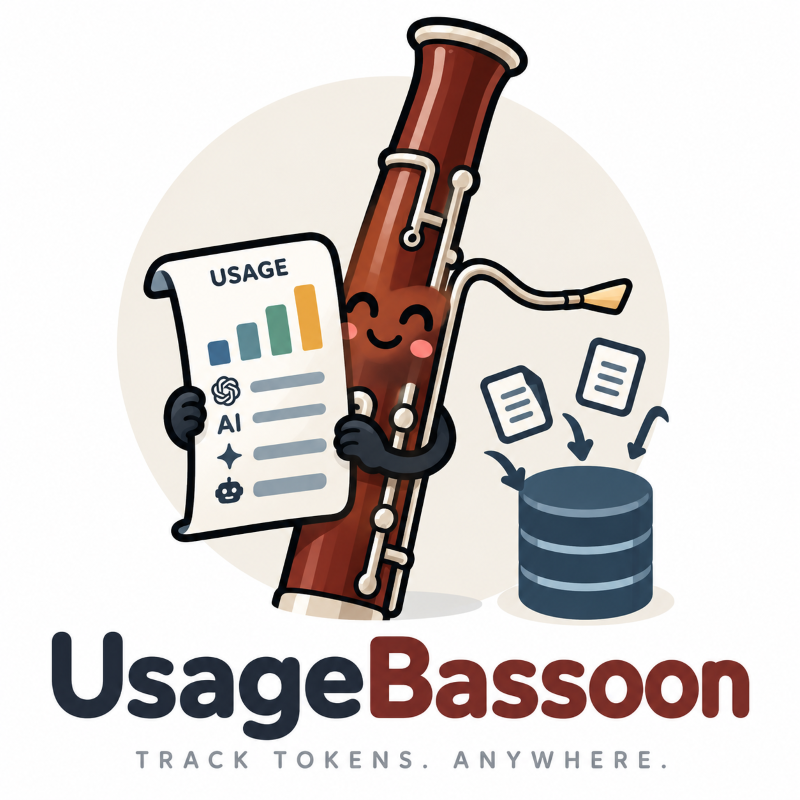

<!--
SPDX-FileCopyrightText: 2026 Israel Flores-Arbolay
SPDX-License-Identifier: AGPL-3.0-only
-->

<h1 align="center">UsageBassoon</h1>

<p align="center">
  
</p>

<p align="center"><strong>Persistent AI token usage statistics no matter where your agents live</strong></p>

<p align="center">
  <a href="https://github.com/israelflores8789/usagebassoon/actions/workflows/ci.yml"></a>
  <a href="https://pypi.org/project/usagebassoon/"></a>
  <a href="https://www.python.org/">=3.12"></a>
  <a href="https://github.com/israelflores8789/usagebassoon/blob/main/LICENSE"></a>
</p>

UsageBassoon turns [`tokscale`](https://github.com/junhoyeo/tokscale)'s stateless JSON output into durable, queryable token-usage history. It is designed for ephemeral containers, rotating VMs, laptops, anywhere you want to track and save your token usage history. It can be run as a scheduled job in macOS, Linux, and container environments.

UsageBassoon supports local DuckDB, MotherDuck, and BigQuery storage, with optional local or Google Cloud Storage snapshots. We recommend BigQuery for persisting token data across environments due to GCP's generous free-tier and easy integration with Google Colab.

Get started with `bassoon --help` or import the Python API with `import usagebassoon`.

## Overview

- Collects daily, per-session, and per-model token statistics, costs, pricing versions, session metadata, and collection-host metadata.
- Publishes observations idempotently: retries and overlapping collections for the same source do not double-count usage. Separate sources retain separate histories.
- Provides terminal reports, bounded relation queries, user-managed tags and notes, diagnostics, exports, and portable snapshots.
- Keeps cloud storage optional: a local DuckDB installation needs no cloud account.

## Table of Contents

- [Getting Started](#getting-started)
- [Terminal Reports](#terminal-reports)
- [Config.toml](#configtoml)
- [Automated Scheduling](#automated-scheduling)
- [Tags and Notes](#tags-and-notes)
- [Python API](#python-api)
- [Privacy and sharing](#privacy-and-sharing)
- [Snapshots](#snapshots)
- [Restoring Your Data](#restoring-your-data)
- [How Persistence Works](#how-persistence-works)
- [Remote Storage Providers Setup](#remote-storage-providers-setup)
  - [MotherDuck setup and permissions](#motherduck-setup-and-permissions)
  - [BigQuery setup and permissions](#bigquery-setup-and-permissions)
  - [Google Cloud Storage setup and permissions](#google-cloud-storage-setup-and-permissions)
- [Why AGPL?](#why-agpl)
- [License & Disclaimers](#license--disclaimers)

## Getting Started

🚀 UsageBassoon requires Python 3.12 or newer and a working [`tokscale`](https://github.com/junhoyeo/tokscale) installation.

For the `bassoon` CLI, we recommend `pipx`. It keeps UsageBassoon's dependencies in their own Python environment and makes `bassoon` available in your terminal without having to manually activate that environment.

```bash
pipx install "usagebassoon"            # minimal install

pipx install "usagebassoon[bigquery]"  # use with BigQuery
pipx install "usagebassoon[gcs]"       # use with Google Cloud Storage
pipx install "usagebassoon[polars]"    # use polars dataframes
pipx install "usagebassoon[full]"      # full installation
```

Want to use `import usagebassoon` in your own Python code or notebook? Install it with `pip` in that project's virtual environment or notebook environment instead. The same optional extras work here too.

```bash
python -m pip install "usagebassoon"        # minimal install
python -m pip install "usagebassoon[full]"  # full installation
```

You can also download the `.whl` file attached to a [GitHub Release](https://github.com/israelflores8789/usagebassoon/releases) and install it directly. Replace `<version>` below with the downloaded wheel's version and run the command from its directory.

```bash
pipx install "./usagebassoon-<version>-py3-none-any.whl"          # CLI installation
python -m pip install "./usagebassoon-<version>-py3-none-any.whl" # Python library installation
```

If you're working from a repository checkout, run this from its root:

```bash
uv tool install ".[full]"              # install from a checkout
```

Then, initialize UsageBassoon.

```bash
bassoon init
```

This creates a configuration file at the [platform-specific default path](#configtoml) when absent, generates a stable `source_id` that is unique to your environment, and initializes a local DuckDB storage backend by default. `init` is safe to repeat. Ordinary commands require an initialized backend and perform a schema preflight. Newer or incompatible schemas fail with an explicit error.

> [!TIP]
> Use `bassoon init` when setting up new environments with an existing `config.toml` as well, especially if using a remote backend. It's idempotent and performs important setup including creating the configured schema, setting `source_id`, and does *not* overwrite your existing configuration file.

Try it out!

```bash
bassoon collect          # your first token usage collection
bassoon report summary   # see the results!
bassoon doctor           # troubleshooting
```

Your first `bassoon collect` includes all usage dates reported by tokscale.

Run `bassoon --help` or `bassoon <command> --help` for the complete command reference.

### Don't forget Tokscale!

```bash
# UsageBassoon uses bun by default
bunx tokscale@4.18.0 --version
```

> [!IMPORTANT]
> Version 4.18.0 is officially supported. Verify the exact version with `tokscale --version` and verify your installation against [`tokscale`'s](https://github.com/junhoyeo/tokscale/releases) official checksums.

> [!NOTE]
> You can set `[tokscale].bin` in `config.toml` or the `TOKSCALE_BIN` environment variable to choose the command; the configuration value takes precedence. With neither set, UsageBassoon uses a local `tokscale` executable when available, otherwise `bunx tokscale@latest`. Pin the supported release with `bin = "bunx tokscale@4.18.0"`.

### Source identity

`source_id` is a unique identifier (UUID) generated when `bassoon init` creates `config.toml` and separates data collected from different environments, even when their client, workspace, or session names match.

> [!TIP]
> If you set `source_id` manually, you can reuse it for ephemeral environments that you want to namespace token usage. For example, if you have a container that should be considered the same as a *unique* previous container build for token statistics purposes.

## Terminal Reports

- `bassoon report summary` shows summary statistics.
- `bassoon report models` shows token, cost, and timing statistics by model and client.
- `bassoon report daily` shows the newest daily usage and cost rows (16 by default).
- `bassoon report sessions` shows the newest sessions.
- `bassoon report graph` renders up to 31 days of daily bars.

All report commands support combined `--client`, `--model`, `--workspace`, `--tag`, and `--source` filters; use `--source local` for the configured source only.

All report commands support inclusive `--since YYYY-MM-DD` and `--until YYYY-MM-DD` bounds on usage days and can also be combined with all other filters. `report sessions`, including with `--by-model`, filters by the last active timestamp or `--sort created-at`.

`--width 100` is the default bounded layout, but `--width max` disables truncation.

UsageBassoon observes each given model's current prices once per UTC day from Tokscale's pricing data, typically sourced from LiteLLM, and prefers rates from the usage date, the latest earlier observation, then the earliest later observation for older backfills. Cost estimates are best-effort calculations, and UsageBassoon honors custom pricing configurations reported through Tokscale.

> [!NOTE]
> **Cost estimates may be underestimated due to model context thresholds.** Tokscale 4.18.0's `pricing` JSON exposes only base rates, and its aggregated usage JSON does not expose request-level context information or token allocation across pricing tiers. UsageBassoon cannot independently reproduce context-threshold surcharges from those aggregates, so calculated costs can differ from Tokscale's reported costs. This limitation concerns *only* pricing; token counts remain preserved as supplied by Tokscale. Costs are estimates, not verified provider charges. We are monitoring Tokscale for metadata support; see [issue #1](https://github.com/israelflores8789/usagebassoon/issues/1).

> [!IMPORTANT]
> Reports are raw by default. Use `--sanitize` before sharing or using `--save <path>` to write a text artifact.

### Summary

```text
$ bassoon report summary --test
UsageBassoon Summary

 Metric       Value
 ━━━━━━━━━━━━━━━━━━
 Sessions        81
 Cost (USD) $109.48

                  Models

 Model            Total Tokens Cost (USD)
 ━━━━━━━━━━━━━━━━━━━━━━━━━━━━━━━━━━━━━━━━
 gemini-3.7-flash       293.4M     $63.13
 gemini-3.8-flash       270.9M     $42.58
 gpt-5.6-terra            9.3M      $3.60
 gpt-5.6-luna             4.7M      $0.18
```

### Models

```text
$ bassoon report models --test
                                  Model Token Usage

 Model            Client    Input Output Cache R Cache ×  Total  ms/1K Cost/1M   Cost
 ━━━━━━━━━━━━━━━━━━━━━━━━━━━━━━━━━━━━━━━━━━━━━━━━━━━━━━━━━━━━━━━━━━━━━━━━━━━━━━━━━━━━
 gemini-3.7-flash opencode  52.4M   1.6M  239.5M   4.57× 293.4M    110  $0.215 $63.13
 gemini-3.8-flash opencode  25.2M   1.4M  244.3M   9.70× 270.9M     60  $0.157 $42.58
 gpt-5.6-terra    codex    436.8K  80.6K    8.8M  20.12×   9.3M    304  $0.387  $3.60
 gpt-5.6-luna     codex    308.7K  22.1K    4.4M  14.09×   4.7M    105  $0.037  $0.18
```

`ms/1K` is calculated from the total measured milliseconds and timed tokens for each model and client. `Cache ×` is cache-read tokens divided by input tokens. Output includes reasoning tokens.

### Daily usage

```text
$ bassoon report daily --test
                       Daily Token Usage

 Date        Input Output Cache R Cache ×  Total   Cost Cost/1M
 ━━━━━━━━━━━━━━━━━━━━━━━━━━━━━━━━━━━━━━━━━━━━━━━━━━━━━━━━━━━━━━
 2026-09-10 391.5K  30.5K    6.2M  15.94×   6.7M  $1.12  $0.168
 2026-09-09 353.9K  72.2K    6.9M  19.48×   7.3M  $2.65  $0.362
 2026-09-08   5.1M 253.8K   29.4M   5.74×  34.7M  $6.99  $0.201
 2026-09-07  14.3M 406.1K   93.5M   6.53× 108.3M $19.27  $0.178
 2026-09-06   9.1M 546.5K  131.2M  14.44× 140.9M $18.71  $0.133
 2026-09-05   2.7M 142.4K   25.8M   9.42×  28.6M  $4.52  $0.158
 2026-09-04   3.1M 226.7K   22.5M   7.26×  25.8M  $4.85  $0.188
 2026-09-03  17.1M 696.2K   63.7M   3.72×  81.5M $20.23  $0.248
 2026-09-02   1.3M  50.7K    6.5M   4.89×   7.9M  $1.69  $0.212
 2026-09-01   2.7M  40.2K   13.1M   4.92×  15.8M  $3.13  $0.198
 2026-08-31   3.2M  98.2K   13.2M   4.14×  16.5M  $3.76  $0.227
 2026-08-30   5.8M 220.0K   29.2M   5.08×  35.2M  $7.33  $0.208
 2026-08-29   7.6M 128.1K   33.8M   4.47×  41.5M  $8.69  $0.209
 2026-08-27   1.3M  44.3K    4.1M   3.22×   5.4M  $1.41  $0.264
 2026-08-26   2.1M  56.5K    7.2M   3.52×   9.3M  $2.29  $0.246
 2026-08-24  56.1K   5.3K   52.6K   0.94× 114.1K  $0.07  $0.579
```

### Session usage

```text
$ bassoon report sessions --test    # add --by-model for per-model detail
                                    # add --with-duration to see session execution time
                                    # add --with-performance to see reasoning latency
                                       Session Token Usage

 Session    Client  Model           Input Output Cache R Cache ×  Total  Cost Cost/1M Last Active
 ━━━━━━━━━━━━━━━━━━━━━━━━━━━━━━━━━━━━━━━━━━━━━━━━━━━━━━━━━━━━━━━━━━━━━━━━━━━━━━━━━━━━━━━━━━━━━━━━
 roll…ad621 codex   gpt-5…-terra    25.1K   2.0K  178.2K   7.10× 205.3K $0.11  $0.535 09-10 03:47
 roll…1be99 codex   gpt-5.6-luna    45.8K   4.5K  229.9K   5.02× 280.2K $0.02  $0.068 09-10 02:55
 roll…960fa codex   gpt-5.6-luna+1 374.8K  28.5K    6.2M  16.54×   6.6M $1.01  $0.154 09-10 00:00
 roll…650cb codex   gpt-5.6-luna+1 299.8K  67.7K    6.5M  21.79×   6.9M $2.63  $0.381 09-09 21:31
 ses_…3cb44 ope…ode ge…3.8-flash     1.8M  82.1K   12.2M   6.61×  14.1M $2.60  $0.185 09-08 03:52
 ses_…5b87f ope…ode ge…3.7-flash+1 806.4K  44.7K    4.5M   5.54×   5.3M $1.11  $0.208 09-08 03:21
 ses_…49afc ope…ode ge…3.7-flash+1   2.7M 169.4K   15.4M   5.74×  18.3M $3.81  $0.208 09-08 02:42
 ses_…9e714 ope…ode ge…3.7-flash+1   2.4M  48.8K    8.7M   3.60×  11.2M $2.65  $0.237 09-07 22:59
 ses_…f2c46 ope…ode ge…3.7-flash     3.4M 130.3K   27.7M   8.19×  31.2M $5.11  $0.163 09-07 05:24
 ses_…5a4d4 ope…ode ge…3.7-flash     1.8M  14.5K   14.2M   8.06×  16.0M $2.44  $0.153 09-07 04:12
 ses_…0fed7 ope…ode ge…3.7-flash     4.7M 128.9K   23.2M   4.93×  28.0M $5.75  $0.205 09-07 03:45
 ses_…aeea9 ope…ode ge…3.8-flash    63.3K   1.4K  170.2K   2.69× 234.9K $0.07  $0.279 09-07 01:23
 ses_…2cbea ope…ode ge…3.8-flash     3.0M 120.0K   34.9M  11.64×  38.0M $5.31  $0.140 09-07 00:44
 ses_…7c07c ope…ode ge…3.8-flash     2.9M 172.0K   55.7M  19.43×  58.7M $6.97  $0.119 09-06 22:56
 ses_…c7cee ope…ode ge…3.8-flash     1.5M  60.4K   16.8M  11.40×  18.4M $2.60  $0.141 09-06 05:10
 ses_…1232c ope…ode ge…3.8-flash     1.6M  67.6K   13.9M   8.83×  15.5M $2.47  $0.159 09-06 03:59
```

### Cost graph

```text
$ bassoon report graph --test       # shows USD cost by default. use `--metric` for token metrics.
                       Cost (USD): 2026-09-01 to 2026-09-10
      ┌────────────────────────────────────────────────────────────────────────┐
$20.23┤               ███████                                                  │
      │               ███████              ██████████████                      │
      │               ███████              ██████████████                      │
$15.17┤               ███████              ██████████████                      │
      │               ███████              ██████████████                      │
      │               ███████              ██████████████                      │
      │               ███████              ██████████████                      │
$10.12┤               ███████              ██████████████                      │
      │               ███████              ██████████████                      │
      │               ███████              █████████████████████               │
 $5.06┤               ██████████████████████████████████████████               │
      │ ██████        ██████████████████████████████████████████ ██████        │
      │ ██████ ██████ ██████████████████████████████████████████ ██████ ██████ │
 $0.00┤ ██████ ██████ ██████████████████████████████████████████ ██████ ██████ │
      └────┬──────┬──────┬──────┬──────┬──────┬──────┬──────┬──────┬──────┬────┘
           01     02     03     04     05     06     07     08     09     10
```

### Daily activity

> [!TIP]
> The heatmap supports truecolor and 256-color terminals. If neither are detected, it falls back to ASCII shading characters. You can toggle ASCII shading characters yourself with `--use-ascii`. If the color is contradictory to your theme, use `--color` and pass an ANSI color name to change the heatmap color. Note, you may need to set `COLORTERM=truecolor` in your shell!

```text
$ bassoon report activity --test --use-ascii
                      Daily Activity

    total (tokens) | 2026-05-14 to 2026-09-10 | linear

    May 2026    Jun         Jul         Aug            Sep
Sun                                              ░░ ▒▒ ██
Mon                                              ░░ ░░ ▒█
Tue                                                 ░░ ▒▒
Wed                                              ░░ ░░ ░░
Thu                                              ░░ ▓▓ ░░
Fri                                                 ▒▒
Sat                                           ░░ ▒▒ ▒▒

Less    ░░ ▒▒ ░█ ▓▓ ▒█ ██ More
Intensity is relative to this selection. Unfilled squares show zero recorded usage.
```

## Config.toml

> [!NOTE]
> UsageBassoon reads by default:
> - Linux: `~/.config/usagebassoon/config.toml`
> - macOS: `~/Library/Application Support/UsageBassoon/config.toml`
> - Windows: `%LOCALAPPDATA%\UsageBassoon\config.toml`
>
> Override by setting the `USAGEBASSOON_CONFIG` environment variable.

```toml
# If you use `Even Better TOML` in VSCode, or similar, you can include the schema for linting in your IDE.
#:schema https://raw.githubusercontent.com/israelflores8789/usagebassoon/main/config.schema.json

# Defaults are shown unless otherwise stated.

source_id = "018f2d70-0000-4000-8000-000000000000"  # Required; typically generated with `bassoon init`. Set manually
                                                    # for identical environments (e.g. respawning a crashed container).
spinner = "pong"                                    # Optional; yaspin animation name, e.g. pong, dots, or line.

[tokscale]                                          # Optional; `bin` overrides `TOKSCALE_BIN` when set.
bin = "bunx tokscale@latest"                        # Command prefix with runner arguments.
                                                    # Examples: `npx tokscale@latest`,
                                                    #           `bunx tokscale@latest`, or
                                                    #           `deno x npm:tokscale@latest`.
env = ["YOUR_ENV_VAR"]                              # Optional; additional env-vars for the tokscale subprocess.
timeout = "120s"                                    # Optional; max duration of one tokscale subprocess call.
max_stdout_bytes = 67108864                         # Optional; max stdout captured from tokscale for one command.
max_stderr_bytes = 8388608                          # Optional; this and the above prevent memory-leaks and abuse.

[backend]
provider = "duckdb"                                 # Optional; duckdb (default), motherduck, or bigquery.

[backend.duckdb]                                    # Optional; defaults to the platform data directory.
database = "path/to/your/database.duckdb"           # Optional; local DuckDB file path.
                                                    # Default: Linux: ~/.local/share/usagebassoon/usagebassoon.duckdb
                                                    #          macOS: ~/Library/Application Support/UsageBassoon/usagebassoon.duckdb
                                                    #          Windows: %LOCALAPPDATA%\UsageBassoon\usagebassoon.duckdb

[backend.bigquery]                                  # Required when backend.provider is `bigquery`.
project = "my-gcp-project"                          # Required; Google Cloud project ID.
dataset = "usagebassoon"                            # Required; BigQuery dataset ID in the project above.
location = "US"                                     # Optional; dataset and job location.
credentials_file = "path/to/gcp-sa-secret.json"     # Optional; default uses Application Default Credentials.
maximum_bytes_billed = 1073741824                   # Optional; per-job maximum bytes billed for BigQuery queries.
timeout = "180s"                                    # Optional; max budget for one BigQuery persistence operation.

[backend.motherduck]                                # Required when backend.provider is `motherduck`.
database = "usagebassoon"                           # Required; MotherDuck database name without the `md:` prefix.
                                                    # Don't forget to set your MOTHERDUCK_TOKEN environment variable!
timeout = "120s"                                    # Optional; max budget for one MotherDuck persistence operation.

[collection]                                        # Optional; persistence retry settings.
max_retries = 3                                     # Optional; additional attempts after the first persistence failure.
retry_initial_seconds = 1.0                         # Optional; positive initial delay for exponential backoff.

[collection.schedule]                               # Optional; automated collection scheduling.
interval = "15m"                                    # Optional; minutes or hours; must exceed tokscale.timeout.

[snapshots]
max_snapshots = 3                                   # Optional; maximum snapshots in rotation.
timeout = "10m"                                     # Optional; max bugdet for one whole snapshot operation.

[snapshots.schedule]                                # Optional; automatic snapshot cadence settings.
interval = "12h"                                    # Optional; minutes, hours, or days.

[snapshots.local]                                   # Optional; local snapshots are enabled by default.
enable = false
disable_weekly = false
path = "path/to/your/snapshots"                     # Optional; local filesystem path or `file://` archive.
                                                    # with `gcs.uri`, snapshots go both locally and to GCS.
                                                    # Default: Linux: ~/.local/share/usagebassoon/snapshots/
                                                    #          macOS: ~/Library/Application Support/UsageBassoon/snapshots/
                                                    #          Windows: %LOCALAPPDATA%\UsageBassoon\snapshots\

[snapshots.gcs]                                     # Optional; remote snapshot bucket.
enable = false
disable_weekly = false
uri = "gs://my-private-bucket/usagebassoon"         # Required; private Google Cloud Storage URI.
project = "my-gcp-project"                          # Required; Google Cloud project ID.
credentials_file = "path/to/gcp-sa-secret.json"     # Optional; default uses Application Default Credentials.

[logging]                                           # Optional; operational logging is enabled by default.
disable = false
max_files = 5                                       # Optional; maximum log files in rotation.
max_bytes = 5242880                                 # Optional; max size of the active log file before rotation (5 MiB).
directory = "path/to/your/logs/"                    # Optional; log files directory.
                                                    # Default: Linux: ~/.local/state/usagebassoon/logs/
                                                    #          macOS: ~/Library/Logs/UsageBassoon/
                                                    #          Windows: %LOCALAPPDATA%\UsageBassoon\Logs\
```

> [!TIP]
> On Linux, default path locations follow `XDG_CONFIG_HOME`, `XDG_DATA_HOME`, and `XDG_STATE_HOME` when those variables are set. UsageBassoon also supports XDG overrides on macOS.

You can enable local and remote snapshot independently, and local snapshots can be enabled concurrently with *one* other remote snapshot destination.

Snapshot destinations are also independent of your storage backend. For example, BigQuery is *not* required to persist snapshots to Google Cloud Storage, and GCS is *not* required to use BigQuery. Furthermore, archives are *backend-agnostic*, so any backend can be archived to any supported destination, and valid snapshots can restore into any initialized, *empty*, supported backend (see: [Restoring Your Data](#restoring-your-data)).

## Automated Scheduling

`bassoon collect` performs one collection cycle. The `schedule` commands manage repeated collection on macOS (launchd), Linux (systemd), and container environments (worker script). Windows Task Scheduler integration is not supported at this time.

```bash
bassoon schedule install --collect-interval 15m
# or, for container environments
bassoon schedule worker --collect-interval 15m

bassoon schedule status
bassoon schedule stop
bassoon schedule remove
```

Run `--help` to get a full options list for each command. Notably, `--collect-interval` and `--snapshot-interval` let you set the cadence of usage collection and snapshot archiving (if configured) from the `15m` and `12h` defaults, respectively, and their values persist in your `config.toml`. Most options work with both `schedule install` and `schedule worker`.

Native schedules launch a new `bassoon collect` process for each cycle and reload `config.toml` for that invocation, but you can rerun `bassoon schedule install` to update a native schedule's interval.

#### Container Environments
```bash
bassoon schedule worker --interval 15m
```

Starts a *detached* self-contained worker and reports its PID and log path, and it's managed in the same way system-native (systemd/launchd) scheduling is managed with `status / logs / stop`.

A worker keeps the configuration loaded at startup for their entire lifetime, including `source_id`, storage backend, logging, and collection interval. Configuration files are *never* hot-swapped. For a detached worker, run `bassoon schedule stop` before editing the your `config.toml`, then run `bassoon schedule worker` to apply the new settings. Restart a foreground worker through its container or process supervisor.

> [!TIP]
> You can run the worker in the foreground so it remains the container's main process:
>
> ```bash
> bassoon schedule worker --foreground --interval 15m
> ```
>
> When using UsageBassoon in a container environment, consider a remote data warehouse like MotherDuck or BigQuery. Consider remote object storage like GCS if you want snapshot archives.

## Tags and Notes

You can group token usage statistics together by `tag`ging all agentic sessions in a project workspace directory, all sessions for an agentic client (e.g. Codex), or for individual sessions, and you can generate reports across environments based on your tags!

```bash
bassoon tag add project-alpha --workspace /work/repo
bassoon tag add production --client codex
bassoon tag add important --client codex --session ses_123

bassoon tag rename project-alpha project-beta
bassoon tag remove project-beta
```

You can use `note` to annotate individual agentic sessions to remember things like why token usage was so high, key things about a session important to a project, or add debugging notes, etc!

```bash
bassoon note set "Investigate cache miss" --client codex --session ses_123
bassoon note edit --id <note-id>
bassoon note remove --id <note-id>

bassoon note list
bassoon note describe <note-id>
```

Tags are transcendental and globally unique. Notes are specific to an agentic session.

## Python API

For library use, install UsageBassoon in your Python environment with `pip install usagebassoon`. Query results are `pandas` DataFrames by default, but you can install the optional Polars extra with `pip install "usagebassoon[polars]"`. You can also use Arrow when you need the raw table:

```python
import usagebassoon

daily        = usagebassoon.query("SELECT * FROM daily_cost LIMIT 1000")
polars_daily = usagebassoon.query("SELECT * FROM daily_cost LIMIT 1000", engine="polars")
arrow_daily  = usagebassoon.query_arrow("SELECT * FROM daily_cost LIMIT 1000")
```

## Privacy and sharing

> [!WARNING]
> UsageBassoon stores raw operational data at rest. Session IDs, workspace and project names, paths, notes, tags, and collector-host metadata may be present in the configured database or snapshots. You should always treat your data as private, and **always** review every UsageBassoon artifact before sharing it.

Your token usage data can contain private information including session IDs, workspace paths, cost information, etc, and UsageBassoon takes that seriously. Some commands are obfuscated by default while others offer a `--sanitize` flag. **Always** use `bassoon doctor` when submitting a bug report, and **always** sanitize your token usage data before sharing it publicly!

> [!IMPORTANT]
> 🔒 Obfuscation reduces exposure, but it is *not* a guarantee that an artifact is safe for every audience. You should *always* review any `bassoon` output for sensitive values before uploading it anywhere.

The commands have deliberately different sharing behavior:

| Command            | Default output                             | Sharing guidance                                             |
|--------------------|--------------------------------------------|--------------------------------------------------------------|
| `bassoon doctor`   | Sanitized diagnostic paths and credentials | Prefer this for issue reports, but *review* it: diagnostics may expose OS, OS version, architecture, CPU, memory, and collection invocation method. Add `--raw` only for private troubleshooting. |
| `bassoon report`   | Raw personal report                        | Add `--sanitize` before sharing.                             |
| `bassoon export`   | Obfuscated export; notes are redacted      | Safe defaults still require review. Add `--raw` only for an intentional private backup or data-management export. |
| `bassoon query`    | Raw relation data                          | It always warns on stderr and may contain session IDs, workspaces, tags, notes, paths, and host metadata. Do not share it publicly. |
| `bassoon snapshot` | Raw restoration archive                    | Keep local and GCS snapshots private; they are not shareable exports. |

`bassoon export` pseudonymizes fields such as session IDs, workspaces, tags, and host identifiers consistently within one output, and redacts notes, embedded filesystem paths, and common credential forms. System metadata remains raw in all cases. No command can infer the sensitivity of your downstream environment, so inspect sanitized output before sharing it.

Discover supported export targets and their descriptions:

```bash
bassoon export --list tables
bassoon export --list views
bassoon export daily_cost usage.parquet
```

Table targets export canonical current state. Exports support Parquet (the default), CSV, and JSON through `--format`.

## Snapshots

You can archive or perform routine backup of your token usage data with `bassoon snapshot` which creates whole-backend archives in Parquet format. Manually invoking `bassoon snapshot` bypasses scheduled snapshots, if configured, and pins it out of rotation (use `--no-pin` if you just want an ephemeral snapshot). See [#configtoml] for default path and settings.

> [!IMPORTANT]
> Snapshots are opt-in and *not* configured by default. Make sure you enable snapshots in your `config.toml` if you want scheduled recovery points!

There are two snapshot cadences: configured and weekly. The default configured cadence is `12h`. Weekly snapshots are rotated every 4 weeks. The weekly cadence is checked at least hourly while the schedule is operational.

Snapshot cadence is independent of collection cadence. `bassoon schedule install / worker` creates separate systemd/launchd snapshot jobs and worker timers, respectively. For cron, you can invoke `bassoon snapshot --automatic`, independently of `bassoon collect`, which captures only due obligations and never pins.

> [!NOTE]
> Snapshots preserve the logical state of the data warehouse at capture time. Snapshots do not capture revisions, original agent session files, or original tokscale payloads. Deleted tags and notes are absent from snapshot state.
>
> Snapshot data is raw and can contain original private values. Handle with care.

## Restoring Your Data

It happens. Sometimes you find the need to start over. Here's how you recover your data from a valid snapshot:

```bash
bassoon init --restore --config recovery.toml

bassoon snapshot list --config recovery.toml
bassoon snapshot audit --config recovery.toml --from-snapshot SNAPSHOT_ID

bassoon restore --config recovery.toml --from-snapshot SNAPSHOT_ID

bassoon doctor --config recovery.toml
```

1. **Stop _all_ UsageBassoon instances before recovery.** This is *crucial*. Recovery *requires* an initialized, **empty** data warehouse and collection quiescence. Make sure you stop your systemd/launchd schedules (`bassoon schedule stop`), container workers, cron jobs, and external writers! We recommend keeping the damaged data warehouse and a separate copy of the recovery archive until recovery is verified.

2. **Create a separate recovery `config.toml`.** This is not required, but is *recommended* for isolation. Make a `recovery.toml` and point UsageBassoon to it with the `--config path/to/recovery.toml` option. Inside your recovery config, point your settings to a fresh, *empty* data warehouse and the existing desired archive.

> [!IMPORTANT]
> Make sure you **preserve the original** `source_id` into your recovery config!
>
> There is no way for UsageBassoon to know if you're recovering from a new environment or an old one. While there are some protections in place, if you have tokscale data on your present environment, you were using UsageBasson until the time of recovery, and you attempt to recover with a different `source_id`, *you risk duplicating your tokscale data in your environment under a new* `source_id`. If you lost your `source_id`, you can use `bassoon audit sources --from-snapshot /path/to/SNAPSHOT_ID` or a remote URI (e.g. GCS). In a pinch, `bassoon audit runs --from-snapshot …` also works.

3. **Initiate the recovery process.** Run `bassoon init --restore` first. It's idempotent, performs several checks, and does some useful backend-specific preparation. Then, run `bassoon restore` to apply a given snapshot into the *empty* data warehouse.

A couple of important notes: we've tried to make `--from-snapshot` durable, so it can accept `latest` to select the latest snapshot among your archives across all configured locations. It can also accept an exact snapshot ID, a snapshot directory, its manifest path, a directory/manifest URI, or an archive root. Setting `--from-snapshot` overrides configured archive roots and use configured credentials or environment authentication.

## How Persistence Works

UsageBassoon supports several data warehouse providers, and it tries to make use of provider-specific features where appropriate. Generally, data warehouses fall into two data model categories: **Direct Transactional Upsert** and **Append-and-Compact**.

Direct Transactional Upsert, currently used with DuckDB and MotherDuck, normalizes a usage collection from Tokscale into a batch and upserts the change in one transaction. For data warehouses that fall into this category, transaction latency is cheap, so we preserved it's implementation simplicity to make custom analytical queries to your data easier.

Append-and-Compact, currently used with BigQuery, uses an "append-and-forget" lifecycle to raw append-only tables every collection run. Those raw tables are then deduplicated and compacted nightly with a platform-native scheduled query script. Data warehouses like BigQuery punish transactions with job latency but excel in simplified data ingest and read queries, and UsageBassoon leverages that behavior.

`bassoon init` is aware of differences between supported backends. For append-and-compact backends, it installs a Scheduled Query that runs at 02:00 UTC. It's also *idempotent*, so it can be rerun to create a missing schedule or update its query and cadence.

## Remote Storage Providers Setup

UsageBassoon currently supports [MotherDuck](https://motherduck.com/docs/getting-started/) and [Google BigQuery](https://docs.cloud.google.com/bigquery/docs?hl=en) for remote databases and [Google Cloud Storage](https://docs.cloud.google.com/storage/docs) for remote snapshot archiving. The following is basic setup requirements and an enumeration of permissions required by UsageBassoon.

*Don't see your backend supported? Consider contributing!*

### MotherDuck setup and permissions

1. Create a service account. See [service-account setup](https://motherduck.com/docs/key-tasks/service-accounts-guide/create-and-configure-service-accounts/).
2. Give the service account the **Explorer** role. See [MotherDuck roles and access control](https://motherduck.com/docs/concepts/roles-and-access-control/).
3. Create a database *as that service account*. This is crucial. If you create the database as your admin account, your service account may not have write access to it.
4. Generate a read/write token for the service account (not your user account!) and set the `MOTHERDUCK_TOKEN` environment variable. See [Manage service account and tokens](https://motherduck.com/docs/key-tasks/service-accounts-guide/manage-service-accounts-and-tokens/).
5. Configure `[backend.motherduck]` in your `config.toml.`

### BigQuery setup and permissions

> [!IMPORTANT]
> Use the most restrictive permissions and least-privilege IAM roles for BigQuery. Use a dedicated service account or user identity scoped to your project and dataset, and avoid broad project-owner permissions.

#### BigQuery setup checklist

1. Install the BigQuery extra with `pipx install "usagebassoon[bigquery]"`, or include `bigquery` alongside your other required extras.
2. In GCP, enable the BigQuery, BigQuery Storage, and BigQuery Data Transfer APIs. UsageBassoon does not enable services itself.
3. Either let `bassoon init` create the dataset in the location configured in `config.toml`, or create it yourself first. An existing dataset must be empty of tables and views before its first initialization.
4. Configure a dedicated service account or your own identity through Application Default Credentials, or set `credentials_file` explicitly in your `config.toml`.
5. Grant the permissions below, configure `[backend.bigquery]`, and run `bassoon init`.
6. You can run `bassoon collect` and `bassoon doctor` to check access and compaction backlog.

> [!NOTE]
> BigQuery uses an "append-and-compact" data model to reduce latency and take advantage of platform features. This means usage data is appended at collect-time and deduplicated in a compaction job nightly. Make sure you verify that the Scheduled Query is enabled! See [How Persistence Works](#how-persistence-works).

#### Permissions UsageBassoon may use

Each permission notes where it is granted and which identity needs it. **Setup** means the identity that runs `bassoon init` or applies a registered schema upgrade. **Runtime** means collection, curation, reports, queries, exports, and snapshots against an already matching schema.

- **BigQuery, project scope**
  - `bigquery.jobs.create`: run queries, loads, and schema statements. Setup, runtime, restore, and scheduled compaction.
  - `bigquery.datasets.create`: create the configured dataset when it does not exist. Setup, when relying on `bassoon init` to create the dataset.
  - `bigquery.readsessions.create / getData / update`: permissions supplied by the Storage Read API role for Arrow result reads. Runtime reads and snapshot capture.
  - `bigquery.transfers.get / update`: create, update, and find compaction schedules. Setup.
  - `bigquery.jobs.listAll`: lets `bassoon doctor` inspect active transactions; required for `bassoon restore`. Doctor, runtime.
- **BigQuery, dataset scope**
  - `bigquery.datasets.get`: check dataset metadata. Setup, runtime, and scheduled compaction.
  - `bigquery.tables.get / getData`: inspect table metadata and read schema state, reports, diagnostics, and snapshots. Setup, runtime, restore, and scheduled compaction as applicable.
  - `bigquery.tables.updateData`: append collection and curation data, seed compaction control data, and write restored or compacted state. Setup, runtime writes, restore, and scheduled compaction.
  - `bigquery.tables.create / update`: create tables and views, set schema labels and retention settings, replace view definitions, and apply registered schema migrations. Setup.
  - `bigquery.tables.list`: discover existing relations during init and check destination contents before restore. Setup and restore.
  - `bigquery.tables.create`, `bigquery.tables.delete`: create and remove temporary restore staging tables. Restore; table creation is also used during setup as noted above.
- **Service account scope**
  - `iam.serviceAccounts.actAs`: attach the service account that runs the compaction schedule, granted on that specific service account. Setup when assigning a service account; also relevant to accessing an existing account-backed schedule for query changes.

#### Roles that provide them

- `roles/bigquery.jobUser` (project-level): `bigquery.jobs.create`.
- `roles/bigquery.readSessionUser` (project-level): the three `bigquery.readsessions.*` permissions listed above.
- `roles/bigquery.dataEditor` (dataset-level): `bigquery.datasets.get` and every `bigquery.tables.*` permission listed above, including create, update, updateData, list, and delete. (This role also includes `bigquery.datasets.create`, but dataset creation requires that permission at project-level.)
- `roles/iam.serviceAccountUser` on the compaction schedule's specific service account: `iam.serviceAccounts.actAs`.
- A custom project-level role containing:
  - `bigquery.datasets.create` (optional): to allow UsageBassoon to initialize a dataset with `bassoon init`.
  - `bigquery.transfers.get / update`: for compaction schedule management. See [scheduled-query permissions](https://docs.cloud.google.com/bigquery/docs/scheduling-queries#required_permissions).
  - `bigquery.jobs.listAll`: for doctor's transaction check and restore. Can also use project-level `roles/bigquery.resourceViewer`.

See Google's [BigQuery IAM roles and permissions](https://docs.cloud.google.com/iam/docs/roles-permissions/bigquery), [dataset access controls](https://docs.cloud.google.com/bigquery/docs/access-control), and [job-metadata permissions](https://docs.cloud.google.com/bigquery/docs/information-schema-jobs#required_permissions).

### Google Cloud Storage setup and permissions

Google Cloud Storage (GCS) is an optional snapshot destination, independent of the storage backend. You can use it with local DuckDB or remote MotherDuck or BigQuery. *GCS snapshots do not require BigQuery or its IAM roles.*

#### Setup checklist

1. Install the GCS extra with `pipx install "usagebassoon[gcs]"`, or include `gcs` alongside your other required extras.
2. In GCP, create a private snapshot bucket. UsageBassoon does not create buckets.
3. Use a dedicated service account and configure `[snapshots.gcs]` in your `config.toml`. You can use Application Default Credentials or set `credentials_file` explicitly in `config.toml`.
4. Grant the bucket permissions below to the service account used for snapshots. *Keep snapshots private*; they contain raw restoration data.
5. Run `bassoon snapshot` to publish an archive and `bassoon doctor` to inspect bucket lifecycle rules.

> [!NOTE]
> UsageBassoon implements archive rotation. Use `STANDARD` storage class to avoid retrieval and early-deletion costs from colder classes. See [storage classes](https://docs.cloud.google.com/storage/docs/storage-classes).

#### Permissions UsageBassoon may use

- **Cloud Storage, snapshot bucket scope**
  - `storage.objects.create / get / delete / list`: publish, read, and rotate snapshot archives and their catalogs, read archives for restore, and read lifecycle rules for doctor. Runtime archive writes and retention, and doctor.

#### Roles that provide them

- `roles/storage.objectUser` on the snapshot bucket for a snapshot writer: object create, get, list, and delete.

See Google's [Cloud Storage IAM roles and permissions](https://docs.cloud.google.com/iam/docs/roles-permissions/storage).

## Why AGPL?

UsageBassoon exists to record statistics about *your* token usage—data you generated with your own activity and money. We believe that data *belongs to you*, and the ability to persist and inspect your own usage history should never sit behind a paywall or a proprietary service.

> Any agentic user should always be able to inspect their token usage history for FREE and answer questions like:
>
> **What did I spend, on which models, and was it worth it?**

The license mirrors that belief. AGPLv3 means that anyone who modifies UsageBassoon and offers it as a network service *must* make their modified source available to its users. That means improvements to the access-layer, the actual mechanic of storing and viewing your token history, remains freely available to everyone that depends on it, and SaaS-based commercial licensing is restricted to genuine value added on top of that access, like dashboards, hosting, and team reporting.

## License & Disclaimers

> [!NOTE]
> **Data disclaimer.** UsageBassoon is a personal, local-first token usage statistics tool. It reads token-usage statistics from your local `tokscale` environment and persists them to either a configurable local DuckDB database or a remote data analytics warehouse. UsageBassoon does not and will **never** collect, aggregate, or sell your token usage data.

---

UsageBassoon is copyright © 2026 Israel Flores-Arbolay and licensed under the GNU Affero General Public License v3.0 (AGPL-3.0-only). See LICENSE for the full text.
